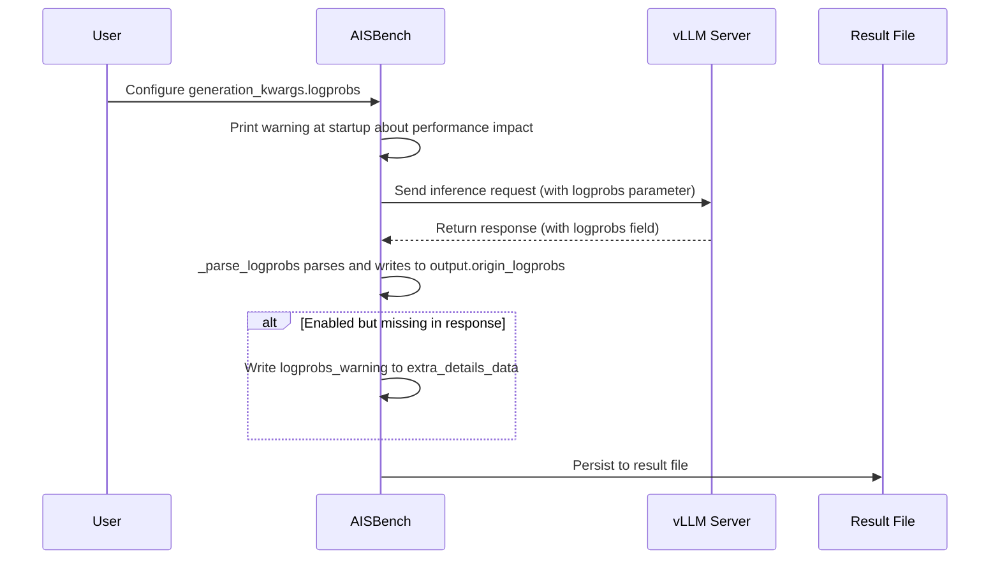

# Logprobs Collection and Analysis

## Overview

In both accuracy evaluation (`--mode accuracy`) and performance evaluation (`--mode perf`) scenarios, AISBench supports enabling **token logprobs collection** via the model configuration's `generation_kwargs`. The token probability information returned by the inference service is persisted to result files for downstream dataset-level post-processing analysis (e.g., avg/min/max/outlier statistics, candidate token distribution analysis).

The collected logprobs data follows the vLLM API's original response format, where each item contains the token text, log probability, byte sequence, and top candidate token distribution.

---

## Prerequisites

1. **vLLM-series inference backend** — Currently only `VLLMCustomAPI` (completions API) and `VLLMCustomAPIChat` (chat API) model types are supported.
2. **Non-streaming interface** — Must configure `stream=False`; streaming mode does not yet support logprobs collection.
3. **Inference service supports logprobs** — The server-side vLLM version must support the `logprobs` / `top_logprobs` parameters.

> ⚠️ **Support scope**: Other API backends (TGI / Triton / Mindie, etc.) and local models (HF, etc.) are not yet supported. Extensions will be added as needed.

---

## Quick Start

Add the `logprobs` parameter to `generation_kwargs` in the model configuration to enable:

```python
from ais_bench.benchmark.models import VLLMCustomAPIChat

models = [
    dict(
        type=VLLMCustomAPIChat,
        abbr='vllm-chat-logprobs',
        host_ip='127.0.0.1', host_port=8080,
        stream=False,                # must be non-streaming
        generation_kwargs=dict(
            temperature=0.6,
            top_p=0.95,
            logprobs=True,           # chat API: enable logprobs collection
            top_logprobs=5,          # optional: return top 5 candidate distribution per token
        ),
    ),
]
```

### Parameter Description

| Parameter | Applicable API | Type | Description |
|-----------|---------------|------|-------------|
| `logprobs` | chat API | Bool | `True` to enable logprobs collection, `False` to disable |
| `logprobs` | completions API | Int | Number of top candidates to return, range `[0, 20]`; `0` disables, `>0` enables and returns the corresponding number of candidates |
| `top_logprobs` | chat API | Int | Number of top candidates per token, range `[0, 20]`. **Only needs separate configuration under chat API**; completions API specifies this directly via `logprobs` |

> 💡 **Distinguishing two API parameter semantics**: For chat API, `logprobs` is a boolean switch and `top_logprobs` separately specifies the candidate count; for completions API, `logprobs` itself is an integer that directly specifies the candidate count, requiring no additional parameter.

---

## How It Works



1. **Startup check**: At model instantiation, checks whether `generation_kwargs` has logprobs enabled; if so, prints a warning about performance impact.
2. **Request sending**: The logprobs parameter in `generation_kwargs` is passed through to the inference service request body.
3. **Response parsing**: The `_parse_logprobs` method parses the logprobs field in the vLLM response into a unified nested structure and writes it to `output.origin_logprobs`.
4. **Anomaly alert**: If the user enabled logprobs but the field is missing in the response, an alert message is written to `output.extra_details_data["logprobs_warning"]`, avoiding false positives on normal requests that don't enable logprobs.
5. **Result persistence**: `origin_logprobs` is output with the result file; empty lists are filtered out.

---

## Persisted Data Structure

### Accuracy Evaluation Scenario

Persisted file: `outputs/<work_dir>/predictions/<model_abbr>/<dataset>.jsonl`

New fields per case:

| Field | Type | Description |
|-------|------|-------------|
| `input_tokens` | Int | Number of input tokens |
| `output_tokens` | Int | Number of output tokens |
| `origin_logprobs` | List[Dict\|None] | Token logprobs information list; not persisted when disabled |

### Performance Evaluation Scenario

Persisted file: `outputs/<work_dir>/performance/<dataset>_details.jsonl`

Each case carries the `origin_logprobs` field via `get_metrics()`'s `to_dict()`; empty lists are filtered out.

### origin_logprobs Data Format

Both **chat API** and **completions API** are unified into the following nested structure:

```json
[
    {
        "token": "Hello",
        "logprob": -0.5234,
        "bytes": [72, 101, 108, 108, 111],
        "top_logprobs": [
            {"token": "Hello", "logprob": -0.5234, "bytes": [72, 101, 108, 108, 111]},
            {"token": "Hi", "logprob": -2.1034, "bytes": [72, 105]}
        ]
    },
    null,
    {
        "token": "world",
        "logprob": -0.0012,
        "bytes": [119, 111, 114, 108, 100],
        "top_logprobs": []
    }
]
```

| Field | Type | Description |
|-------|------|-------------|
| `token` | String | Token text |
| `logprob` | Float | Log probability of the token |
| `bytes` | List[Int] | UTF-8 byte sequence of the token (only returned by chat API; completions API does not include this field) |
| `top_logprobs` | List[Dict] | Top candidate token distribution, each item contains `token` / `logprob` / `bytes`. Empty array when `top_logprobs` is not configured |

> ⚠️ **Meaning of `null` entries**: The `logprob` of the first item in the token sequence may be `null` (indicating a predefined token with no probability value). `null` entries are preserved to align token positions for position-indexed analysis.

### logprobs_warning Field

When the user enables logprobs but the inference service response is missing the field, a `logprobs_warning` field appears in the result file (under `extra_details_data`):

```json
{
    "extra_details_data": {
        "logprobs_warning": "logprobs is enabled in generation_kwargs but missing in response"
    }
}
```

**Possible causes**:
- Inference service version does not support the logprobs parameter
- Request parameter was ignored or filtered by the server
- Backend model type is incompatible with logprobs

> 💡 **Design note**: Missing logprobs does not trigger request retry (unlike `error_info`); it serves only as an alert for the user to check the configuration.

---

## Configuration Scenario Comparison

| Configuration | chat API persistence effect | completions API persistence effect |
|---------------|----------------------------|-----------------------------------|
| logprobs not configured | No `origin_logprobs` field | No `origin_logprobs` field |
| `logprobs=True` (chat) / `logprobs=1` (completions) | `origin_logprobs` contains token/logprob/bytes; `top_logprobs` is empty array | `origin_logprobs` contains token/logprob; `top_logprobs` is empty array |
| `logprobs=True` + `top_logprobs=5` (chat) / `logprobs=5` (completions) | `origin_logprobs` contains full candidate distribution | `origin_logprobs` contains full candidate distribution |

---

## Performance Impact and Precautions

> ⚠️ **Important**: Enabling logprobs significantly increases response size, affecting evaluation efficiency and memory usage.

### Response Size Estimation

Taking `max_out_len=4096` as an example:

| Configuration | Estimated single response size |
|---------------|-------------------------------|
| logprobs disabled | A few KB (text + usage only) |
| `logprobs=True` (no top_logprobs) | ~200-400 KB (~50-100B per token) |
| `logprobs=True` + `top_logprobs=20` | ~4-8 MB (~1-2KB per token) |

### Risk Points

| Risk | Description |
|------|-------------|
| **Memory peak** | During response parsing, `response.text()` + `json.loads` + `output.origin_logprobs` hold three copies in memory simultaneously |
| **Concurrency amplification** | The worker loop runs `batch_size` concurrent requests, each holding a large response |
| **Disk amplification** | Each case's jsonl writes full logprobs, disk usage grows linearly |
| **No body size limit** | AISBench currently does not constrain response body size in non-streaming scenarios |

### Recommendations

1. **Limit `top_logprobs` value** (e.g., ≤5) — this is the primary factor in response bloat
2. **Control the product of `max_out_len` and `batch_size`** to avoid high concurrency memory peaks
3. **Validate with a small dataset first** before running full data, confirming server-side support
4. **Watch startup warnings**: AISBench prints a logprobs performance impact notice at startup
