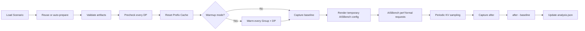
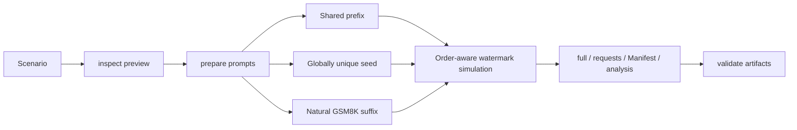

# Prefix Cache Dataset Generation, Benchmarking, and Hit-Rate Analysis

## Overview

The AISBench Prefix Cache plugin generates datasets with controlled shared prefixes, calculates the theoretical Prefix Cache hit rate, and then uses AISBench and vLLM to collect the actual hit rate. It evaluates how input lengths, shared-prefix ratios, Prefix Groups, request ordering, and multiple DP ranks behind one endpoint affect cache hits.

The plugin provides five commands:

- `inspect`: preview the scenario, reachable range, and length distributions;
- `prepare`: generate formal requests, a Manifest, and theoretical analysis;
- `validate`: detect modified, truncated, reordered, or inconsistent artifacts;
- `run`: probe and reset the service, warm every group on every DP rank, and run the formal AISBench benchmark;
- `analyze`: recompute actual hit rates offline from two Prometheus snapshots.

`inspect`, `prepare`, and `validate` are offline. Only `run` connects to vLLM. One HTTP endpoint with one or more internal DP ranks is supported; multiple independent inference-server instances are not.

---

## Prerequisites

1. **Python 3.10 or later**.
2. **An AISBench checkout whose dependencies can be imported**.
3. **The same tokenizer as the target vLLM server**. A mismatch changes token counts, Block boundaries, and the theoretical hit rate.
4. **A GSM8K JSONL corpus**. Every non-empty line must be a JSON object containing the text field selected by `corpus.field`, which defaults to `question`.
5. **The correct Prefix Cache Block size**. `tokenizer.block_size` must match the target server.
6. **Service capabilities for online run**: `/v1/completions`, `/metrics`, optionally `/reset_prefix_cache`, plus `X-data-parallel-rank` routing and per-DP `engine` metric labels for multi-DP.

---

## Installation

The following commands assume that the current directory is the AISBench repository root:

```shell
python -m venv .venv
source .venv/bin/activate
python -m pip install -e .
python -m pip install -e ./plugins/prefix_cache
ais-bench-prefix-cache --help
```

The editable (`-e`) installs normally make source changes available without reinstalling the packages.

---

## Quick Start

Copy the example Scenario:

```shell
cp ./plugins/prefix_cache/config_examples/scenario.example.json ./scenario.json
```

At minimum, review `tokenizer.path`, `tokenizer.block_size`, and `corpus.path`. When modeling cold multi-DP routing or producing a warmup plan, also set `service.dp_size` to the number of DP ranks on the target server.
Before an online benchmark, also review the service URLs, `service.model`, and `aisbench.config`.

A minimal example is shown below:

```json
{
  "schema_version": "1.0",
  "run": {
    "run_id": "gsm8k-prefix-cache-60",
    "random_seed": 42,
    "output_dir": "./outputs/gsm8k-prefix-cache-60"
  },
  "tokenizer": {
    "path": "/path/to/tokenizer",
    "block_size": 16
  },
  "corpus": {
    "path": "./GSM8K.jsonl",
    "field": "question",
    "selection": {"mode": "random"}
  },
  "requests": {
    "count": 100,
    "input_length": {"mode": "fixed", "value": 1024},
    "output_length": {"mode": "fixed", "value": 32}
  },
  "prefix_cache": {
    "mode": "warmup",
    "target_hit_rate": 0.6,
    "seed_blocks": 1,
    "groups": {"count": 1, "assignment": {"mode": "uniform"}},
    "order": {"strategy": "interleave"}
  },
  "service": {"dp_size": 2}
}
```

Run the commands in order:

```shell
ais-bench-prefix-cache inspect --scenario ./scenario.json
ais-bench-prefix-cache prepare --scenario ./scenario.json
ais-bench-prefix-cache validate --manifest \
  ./outputs/gsm8k-prefix-cache-60_<timestamp>/result/gsm8k-prefix-cache-60_<timestamp>.manifest.json
ais-bench-prefix-cache run --scenario ./scenario.json
```

Formal AISBench requests use vLLM SSE streaming by default (`aisbench.model.stream=true`). Request-start, first-chunk, and subsequent chunk timestamps are used to produce TTFT, TPOT, ITL, E2EL, and throughput metrics. Prefix Cache hit rate can still be measured when this option is `false`, but complete chunk-based TTFT, TPOT, and ITL metrics are unavailable. Precheck and plugin warmup use separate non-streaming requests before the baseline and are excluded from formal performance statistics.

With saved Prometheus snapshots, recompute without contacting vLLM:

```shell
ais-bench-prefix-cache analyze \
  --manifest <manifest-path> \
  --baseline ./baseline.prom \
  --after ./after.prom
```

---

## `run`: Execute an Online Prefix Cache Benchmark

```shell
ais-bench-prefix-cache run --scenario ./scenario.json
ais-bench-prefix-cache run --scenario ./scenario.json --config ./my_prefix_cache_perf.py
```

`--scenario` supplies dataset construction, service, validation, and AISBench settings. The optional `--config` overrides only the AISBench Python template for this invocation and does not modify the Scenario. `run` reuses a matching inspect/prepared Manifest and automatically runs prepare when the timestamped task directory does not yet contain formal artifacts.

The complete online sequence is:



The phase boundaries are:

1. `precheck` sends a probe to every DP rank and verifies that query, hit, and KV metrics can be parsed. Multi-DP requests use `X-data-parallel-rank` for deterministic routing.
2. `reset` calls `service.reset_url`. If it is missing or fails, execution continues with a warning only when `service.assume_empty_cache=true`.
3. In warmup mode, every `Prefix Group × DP rank` is warmed according to the Manifest plan. The baseline is captured after plugin warmup, so cumulative counters produced by probes and warmup are removed by subtraction.
4. The formal phase renders `aisbench.dataset`, `aisbench.model`, artifact paths, and service settings into a temporary Python configuration and starts AISBench in `perf` mode. KV Cache gauge values are sampled every `service.poll_interval_seconds`; set it to `0` to disable periodic sampling.
5. After AISBench exits successfully, the plugin captures the after snapshot, computes per-DP and global queries, hits, and hit rate from `after - baseline`, and writes theory-versus-actual differences back to analysis.

Plugin warmup and AISBench's own `--num-warmups` are independent mechanisms. To ensure that only formal requests occur after the baseline, configure:

```json
"aisbench": {
  "extra_args": ["--num-warmups", "0"]
}
```

Prefix Cache phase logs are written only to `log/<run_id>.run.log`. The AISBench child process inherits stdout/stderr, so its progress and performance output remain visible in the terminal. On success, the final stdout object is the complete analysis JSON. A non-zero AISBench exit code, missing service capability, or artifact validation failure makes `run` fail.

---

## `analyze`: Recompute from Prometheus Snapshots Offline

```shell
ais-bench-prefix-cache analyze \
  --manifest <manifest-path> \
  --baseline ./baseline.prom \
  --after ./after.prom
```

Use `analyze` when pre- and post-benchmark `/metrics` text has already been saved and the result must be recomputed with the current parser or independently checked. It does not connect to vLLM, send requests, or launch AISBench.

- `--manifest`: a prepared Manifest. The command first validates full/requests row counts, order, and SHA-256, then reads `dp_size`, `engine_label_map`, and warning thresholds from `effective_config.service`.
- `--baseline`: complete Prometheus text captured before the formal measurement window.
- `--after`: complete Prometheus text captured after the window. Queries and hits are cumulative counters, so their values must not be lower than the baseline.

The command parses both snapshots, subtracts per-DP queries and hits, aggregates `actual.global_hit_rate`, compares it with `theoretical_hit_rate`, and emits `ACTUAL_DEVIATION` when required. It writes `status="analyzed"` to the analysis artifact indexed by the Manifest; `runtime` contains only `metrics_baseline` and `metrics_after`. Offline snapshots have no formal-run sampling sequence, so `runtime.kv_cache_polling` and run-time KV averages/peaks are not produced. Prometheus metrics also have no Prefix Group label, so actual statistics are per-DP and global, while group-level statistics remain theoretical.

The current CLI uses the same `log/<run_id>.validate.log` filename for `analyze` and `validate`; the later command recreates that file. Stdout contains the updated complete analysis JSON. Target or actual deviations produce only `PASS_WITH_WARNING` and do not change an otherwise successful exit code.

---

## How It Works



Every formal request consists of three regions:

```text
shared prefix + globally unique seed + natural GSM8K suffix
```

- The shared prefix is aligned to `block_size` and is the main source of theoretical hits.
- The seed length is `seed_blocks × block_size`. It is globally unique for every request, preventing accidental sharing beyond the intended prefix.
- The natural suffix is selected, concatenated, and truncated from GSM8K questions so the non-shared region remains natural-language content.

The plugin solves for the shared-prefix length of every request from the target global hit rate, then simulates cache watermarks in final request order. The nearest reachable final hit-token total remains the hard constraint. Among schedules with the same final total, warmup balances prefixes across cumulative input, while cold mode uses Prefix Group/DP-lane watermarks to minimize cumulative-rate overshoot and decline before tracking the target. A strictly monotonic path can be impossible when a late lane has a compulsory first miss or insufficient capacity, but the solver no longer defaults to front-loading hits and compensating with short tail prefixes.

---

## Core Scenario Configuration

See the [complete Scenario field reference](../../../plugins/prefix_cache/config_examples/scenario.example_en.md).

### Complete Field Index

| Configuration path | Brief description |
|---|---|
| `schema_version` | Scenario configuration format version. |
| `run` | Task identity, randomness, and output controls. |
| `run.run_id` | Task name; a timestamp is appended at execution. |
| `run.random_seed` | Global seed for generation and random selection. |
| `run.output_dir` | Base directory for Prefix Cache artifacts. |
| `run.overwrite` | Whether existing formal artifacts may be overwritten. |
| `tokenizer` | Tokenizer loading and Block configuration. |
| `tokenizer.path` | Tokenizer model or directory path. |
| `tokenizer.block_size` | Prefix Cache Block size in tokens. |
| `tokenizer.revision` | Tokenizer repository revision; `null` uses the default. |
| `tokenizer.trust_remote_code` | Whether to trust custom Tokenizer code. |
| `corpus` | Natural-suffix corpus configuration. |
| `corpus.path` | Path to the GSM8K JSONL file. |
| `corpus.field` | JSONL field containing question text. |
| `corpus.selection` | GSM8K sample-selection rule. |
| `corpus.selection.mode` | Selection mode: random, index, hash, or mixed. |
| `corpus.selection.values` | Index or hash list for a non-mixed mode. |
| `corpus.selection.indices` | Zero-based index list for mixed mode. |
| `corpus.selection.question_sha256` | Question SHA-256 list for mixed mode. |
| `requests` | Formal request count and length distributions. |
| `requests.count` | Total number of formal requests. |
| `requests.input_length` | Input-token length generation rule. |
| `requests.input_length.mode` | Input-length mode. |
| `requests.input_length.value` | Fixed length used by fixed mode. |
| `requests.input_length.values` | Length list used by explicit mode. |
| `requests.input_length.ranges` | Range list used by range mode. |
| `requests.input_length.ranges[].min` | Lower bound of one sampling range. |
| `requests.input_length.ranges[].max` | Upper bound of one sampling range. |
| `requests.input_length.ranges[].count` | Number of requests generated from one range. |
| `requests.input_length.min` | Lower bound of the truncated normal distribution. |
| `requests.input_length.max` | Upper bound of the truncated normal distribution. |
| `requests.input_length.mean` | Mean of the truncated normal distribution. |
| `requests.input_length.std` | Standard deviation of the truncated normal distribution. |
| `requests.input_length.path` | Length-file path used by csv mode. |
| `requests.output_length` | Maximum output-token length generation rule. |
| `requests.output_length.mode` | Output-length mode. |
| `requests.output_length.value` | Fixed length used by fixed mode. |
| `requests.output_length.min` | Lower bound for uniform/truncated-normal mode. |
| `requests.output_length.max` | Upper bound for uniform/truncated-normal mode. |
| `requests.output_length.mean` | Mean of the truncated normal distribution. |
| `requests.output_length.std` | Standard deviation of the truncated normal distribution. |
| `requests.output_length.path` | Length-file path used by csv mode. |
| `output` | Field controls for the compact request file. |
| `output.output_key` | Optional output-length key; `null` omits it. |
| `prefix_cache` | Prefix Cache data and runtime strategy. |
| `prefix_cache.mode` | Cache mode: `cold` or `warmup`. |
| `prefix_cache.target_hit_rate` | Requested global Prefix Cache hit rate. |
| `prefix_cache.seed_blocks` | Number of Blocks used by each unique seed. |
| `prefix_cache.minimum_non_shared_length` | Minimum non-shared tokens retained per request. |
| `prefix_cache.groups` | Prefix Group count, assignment, and overrides. |
| `prefix_cache.groups.count` | Total number of Prefix Groups. |
| `prefix_cache.groups.assignment` | Rule assigning requests to Groups. |
| `prefix_cache.groups.assignment.mode` | Group-assignment mode. |
| `prefix_cache.groups.assignment.exponent` | Hotspot exponent for Zipf assignment. |
| `prefix_cache.groups.assignment.weights` | Relative Group weights for weights mode. |
| `prefix_cache.groups.overrides` | Optional per-Group overrides. |
| `prefix_cache.groups.overrides.group-N.input_length` | Input-length rule for one Group. |
| `prefix_cache.groups.overrides.group-N.output_length` | Output-length rule for one Group. |
| `prefix_cache.groups.overrides.group-N.corpus_selection` | Corpus-selection rule for one Group. |
| `prefix_cache.order` | Formal request ordering rule. |
| `prefix_cache.order.strategy` | Sequential, interleaved, shuffled, or length-ascending order. |
| `service` | Online inference service and metric collection. |
| `service.inference_url` | vLLM inference endpoint. |
| `service.metrics_url` | Prometheus metrics endpoint. |
| `service.reset_url` | Prefix Cache reset endpoint. |
| `service.model` | Service model name sent in the request body. |
| `service.dp_size` | Number of DP ranks inside one instance. |
| `service.assume_empty_cache` | Assume an empty cache when reset is unavailable. |
| `service.engine_label_map` | Mapping from Prometheus engine label to DP rank. |
| `service.timeout_seconds` | Timeout for probes, warmup, and metrics requests. |
| `service.api_key` | Service credential; never persisted in plaintext. |
| `service.poll_interval_seconds` | KV metric sampling interval during the formal run. |
| `validation` | Result-deviation warning thresholds. |
| `validation.target_warning_pp` | Warning threshold for theory-versus-target deviation. |
| `validation.actual_warning_pp` | Warning threshold for actual-versus-theory deviation. |
| `aisbench` | AISBench formal benchmark launch configuration. |
| `aisbench.config` | Path to the AISBench Python configuration template. |
| `aisbench.work_dir` | Base directory for AISBench results. |
| `aisbench.extra_args` | Arguments appended to the AISBench command. |
| `aisbench.dataset` | Dataset reader and Prompt mapping configuration. |
| `aisbench.dataset.abbr` | Dataset display name; `null` generates one. |
| `aisbench.dataset.input_columns` | Input columns used by the Dataset reader. |
| `aisbench.dataset.output_column` | Reference-answer column used by the reader. |
| `aisbench.dataset.prompt_template` | Prompt template for formal requests. |
| `aisbench.dataset.pred_role` | Role name assigned to predictions. |
| `aisbench.model` | AISBench API Model configuration. |
| `aisbench.model.abbr` | Model display name; `null` generates one. |
| `aisbench.model.attr` | Model attribute; currently must be `service`. |
| `aisbench.model.stream` | Whether to use SSE streaming responses. |
| `aisbench.model.max_out_len` | Model-level fallback maximum output length. |
| `aisbench.model.retry` | Number of retries after API failures. |
| `aisbench.model.batch_size` | Base AISBench API concurrency. |
| `aisbench.model.generation_kwargs` | Generation arguments forwarded to vLLM. |

Unknown Scenario fields are rejected. Offline calculations use `service.dp_size`; `run` consumes the service URLs, model, reset/empty-cache policy, metric mapping, timeout, API key, and the complete `aisbench` section.

### Input and Output Lengths

`requests.input_length` supports:

- `fixed`: one fixed length;
- `explicit`: an explicit list of lengths;
- `range`: sampling from one or more inclusive ranges;
- `truncated_normal`: a bounded normal distribution;
- `csv`: values from `input_prompt_tokens`, `content_tokens`, or `input_tokens`.

`requests.output_length` supports:

- `fixed`;
- `uniform`;
- `truncated_normal`;
- `csv`, using an `output_tokens` column.

All lengths must be positive integers. Global explicit lists, range counts, and CSV row counts must equal `requests.count`. A group override must instead produce exactly the number of requests assigned to that group.

### GSM8K Selection

`corpus.selection.mode` supports:

- `random`: deterministic shuffling based on `run.random_seed`;
- `indices`: zero-based GSM8K line numbers;
- `question_sha256`: SHA-256 of normalized question text;
- `mixed`: append `indices` first and `question_sha256` second.

When fewer records are specified than required, the selected sequence is reused cyclically. Both mixed-mode lists cannot be empty.

### Prefix Groups

`prefix_cache.groups.assignment.mode` supports:

- `uniform`: distribute requests as evenly as possible;
- `zipf`: use `exponent` to control hotspot concentration;
- `weights`: provide relative group weights in `weights`.

Each Prefix Group has its own canonical prefix, cache watermark, and theoretical statistics. `groups.overrides.group-N` can override input lengths, output lengths, and corpus selection for one group.

### requests.jsonl Output Field

```json
"output": {"output_key": null}
```

With the default `null`, each row contains only `question` and `answer`. Set the value to `"max_tokens"` or `"output_tokens"` to append that third key; both carry the internal maximum output-token value. `full.jsonl.max_tokens` is always retained, and AISBench reads the generation length from full, so omitting the public field does not affect execution.

### Request Ordering

`prefix_cache.order.strategy` supports:

- `sequential`;
- `within_group_shuffle`;
- `interleave`;
- `global_shuffle`;
- `input_len_asc`.

The theoretical hit rate is always recomputed using the final reordered request sequence. To model an unwarmed cache growing from short to long requests, combine `prefix_cache.mode="cold"` with `order.strategy="input_len_asc"`. Prepare writes requests in ascending input-length order within each group, and at run time `LaneSequencer` releases the next request on a `(group_id, dp_rank)` lane only after its predecessor finishes. Independent Group/DP caches may still run concurrently.

---

## Cold and Warmup Modes

### cold

- Every `(group_id, dp_rank)` lane starts from an empty cache watermark.
- Requests in a group are routed round-robin to DP ranks in group occurrence order.
- `full.jsonl` records `dp_rank` and `lane_sequence`.
- Each lane is simulated independently and then aggregated using token weighting.

### warmup

- One warmup item is generated for every `Prefix Group × DP rank`.
- The plan is written to `warmup.plan` in the Manifest.
- Warmup requests are not written to `requests.jsonl` and are excluded from the formal request count and theoretical denominator.
- `prepare` only generates the plan; `run` sends every item to its designated `Prefix Group × DP rank` before the formal baseline.

---

## Theoretical Hit Rate and Reachability

For an independent cache lane, if the watermark before a request is `watermark` and the request has `shared_prefix_tokens`, the theoretical hit count is:

```text
hit_tokens = min(shared_prefix_tokens, watermark)
watermark_after = max(watermark, shared_prefix_tokens)
```

The global result is token weighted:

```text
global_hit_rate = sum(theoretical_hit_tokens) / sum(actual_input_tokens)
```

The plugin reports:

- `requested_target_hit_rate`: the requested Scenario target;
- `effective_target_hit_rate`: the nearest reachable target selected by the solver;
- `theoretical_hit_rate`: the value simulated in final request order;
- `reachable_min` and `reachable_max`: the theoretical range under current constraints;
- `target_reachable`: whether the requested target falls within that range.

Block alignment, unique seeds, natural suffixes, Prefix Groups, ordering, and cold DP lanes can all make a target unreachable.

---

## Output Layout and Timestamps

Timestamps use `_YYYYMMDD_HHMMSS`. In the recommended workflow, `inspect` creates the timestamp and a lightweight Manifest; `prepare` and `run` reuse the task through that Manifest:

```text
outputs/gsm8k-prefix-cache-60_20260825_123456/
├── log/
│   ├── gsm8k-prefix-cache-60_20260825_123456.inspect.log
│   ├── gsm8k-prefix-cache-60_20260825_123456.prepare.log
│   ├── gsm8k-prefix-cache-60_20260825_123456.validate.log
│   └── gsm8k-prefix-cache-60_20260825_123456.run.log
└── result/
    ├── gsm8k-prefix-cache-60_20260825_123456.full.jsonl
    ├── gsm8k-prefix-cache-60_20260825_123456.requests.jsonl
    ├── gsm8k-prefix-cache-60_20260825_123456.manifest.json
    └── gsm8k-prefix-cache-60_20260825_123456.analysis.json
```

No standalone `<output_dir>.inspect.json` is created. `inspect` stores its summary in `result/<timestamped_run_id>.manifest.json` with `status="inspected"`. When the Scenario SHA-256, timestamped run/output values, and status match, `prepare` upgrades that file in place to `status="prepared"`; `run` can then reuse it. A Scenario content change automatically makes the old Manifest ineligible.

---

## Artifacts

| Artifact | Purpose |
|---|---|
| `full.jsonl` | Complete audit rows: group, DP lane, input lengths, shared prefix, unique seed, GSM8K sources, theoretical watermark, and collision state. |
| `requests.jsonl` | Minimal AISBench requests. Rows contain `question` and `answer` by default; `output.output_key` may append `max_tokens` or `output_tokens`. |
| `manifest.json` | Effective configuration, input hashes, tokenizer fingerprint, length distributions, reachable ranges, groups, DP, warmup plan, and artifact hashes. |
| `analysis.json` | Requested/effective/theoretical/actual rates, baseline/after snapshots, theoretical group statistics, theoretical/actual per-DP statistics, differences, validation state, and warnings. |

The plaintext `service.api_key` is not stored in the Manifest; only `api_key_configured` is recorded.

The fixed field index is listed below. Fields marked as optional or phase-specific appear only under the corresponding configuration or execution phase.

### `requests.jsonl` Fields

| Field | Brief description |
|---|---|
| `question` | Complete Prompt sent to the model. |
| `answer` | Reference answer used by AISBench. |
| `max_tokens` | Optional maximum output-token count. |
| `output_tokens` | Optional alias for `max_tokens`. |

`output.output_key` may append either `max_tokens` or `output_tokens`; neither is present by default.

### `full.jsonl` Fields

| Field | Brief description |
|---|---|
| `request_id` | Globally unique request identifier. |
| `sequence_index` | Global index in final send order. |
| `group_id` | Prefix Group containing the request. |
| `occurrence_index_within_group` | Occurrence index inside the Group. |
| `dp_rank` | Target DP rank in cold mode. |
| `lane_sequence` | Sequence number within a `(group_id, dp_rank)` lane. |
| `target_input_tokens` | Configured target input-token count. |
| `actual_input_tokens` | Actual input tokens verified by the Tokenizer. |
| `max_tokens` | Maximum tokens allowed for this response. |
| `shared_prefix_tokens` | Number of reusable shared-prefix tokens. |
| `seed_tokens` | Number of globally unique seed tokens. |
| `natural_suffix_tokens` | Number of natural-suffix tokens. |
| `question` | Complete Prompt composed of prefix, seed, and suffix. |
| `answer` | AISBench reference answer. |
| `gsm_indices` | Zero-based GSM8K rows used by the natural suffix. |
| `gsm_hashes` | SHA-256 values of the suffix source questions. |
| `canonical_prefix_sha256` | Digest of the Group canonical prefix. |
| `seed_sha256` | Digest of this request's unique seed. |
| `request_random_seed` | Random seed derived for this request. |
| `watermark_before` | Simulated cache-lane watermark before the request. |
| `theoretical_hit_tokens` | Tokens theoretically hit by this request. |
| `watermark_after` | Simulated cache-lane watermark after the request. |
| `theoretical_hit_rate` | Theoretical hit rate of this request. |
| `divergence_block_sha256` | Digest used to validate the divergence Block. |
| `divergence_unique` | Whether the divergence Block is globally unique. |
| `collision_status` | Prefix or seed collision-check result. |

### `manifest.json` Top-Level Fields

| Field | Brief description |
|---|---|
| `schema_version` | Manifest data-structure version. |
| `plugin_version` | Plugin version that produced the artifacts. |
| `status` | `inspected` or `prepared` state. |
| `run_id` | Timestamped task identifier. |
| `scenario_path` | Path to the original Scenario file. |
| `scenario_sha256` | Digest of the original Scenario file. |
| `effective_config` | Effective configuration after defaults are applied. |
| `effective_config_sha256` | Digest of the effective configuration. |
| `corpus_sha256` | Digest of the GSM8K corpus file. |
| `tokenizer` | Tokenizer identity and Block information. |
| `requests` | Request count, token total, and length summaries. |
| `prefix_cache` | Mode, hit rates, and reachability results. |
| `groups` | Independent statistics for each Prefix Group. |
| `dp` | DP count and cold-routing strategy. |
| `warmup` | Group × DP warmup plan. |
| `divergence` | Seed/divergence-block uniqueness summary. |
| `artifacts` | Paths, sizes, and digests of generated artifacts. |
| `inspect` | Preview information in an inspect-only Manifest. |

A prepared Manifest uses all fields above except `inspect`. An inspect-only Manifest has `status="inspected"` and stores its preview under `inspect.summary`.

### `analysis.json` Top-Level Fields

| Field | Brief description |
|---|---|
| `schema_version` | Analysis data-structure version. |
| `run_id` | Corresponding timestamped task identifier. |
| `status` | `prepared` or `complete` state. |
| `requested_target_hit_rate` | Hit-rate target requested by the Scenario. |
| `effective_target_hit_rate` | Nearest reachable target chosen by the solver. |
| `theoretical_hit_rate` | Rate simulated in final request order. |
| `target_difference_pp` | Absolute percentage-point gap between theory and target. |
| `target_signed_difference_pp` | Signed theory-minus-target gap in percentage points. |
| `target_absolute_difference_pp` | Absolute theory-versus-target gap in percentage points. |
| `validation` | Reachability, status, and warning policy. |
| `theory` | Theoretical token, Group, and DP statistics. |
| `warnings` | Warnings produced by this run. |
| `runtime` | Run phases, warmup, and metric snapshots. |
| `actual` | Actual hit statistics computed from metric deltas. |
| `theory_actual_difference_pp` | Absolute actual-versus-theory gap in percentage points. |
| `theory_actual_signed_difference_pp` | Signed actual-minus-theory gap in percentage points. |
| `theory_actual_absolute_difference_pp` | Absolute actual-versus-theory gap in percentage points. |

`runtime`, `actual`, and the three `theory_actual_*` fields are appended by the run/analyze phase.

### `inspect` stdout Fields

| Field | Brief description |
|---|---|
| `run_id` | Scenario task name before timestamping. |
| `mode` | `cold` or `warmup` mode. |
| `requested_target_hit_rate` | Hit rate requested by the user. |
| `effective_target_hit_rate` | Nearest reachable target hit rate. |
| `theoretical_hit_rate` | Predicted theoretical hit rate. |
| `reachable_min` | Minimum globally reachable hit rate. |
| `reachable_max` | Maximum globally reachable hit rate. |
| `target_reachable` | Whether the target is inside the reachable range. |
| `group_reachability` | Reachable range of every Group. |
| `groups` | Request count for every Group. |
| `input_tokens` | Input-length statistics and total token count. |
| `output_tokens` | Output-length statistics and total token count. |
| `dp_route_counts` | Formal request count for every DP rank. |
| `sends_requests` | Whether online requests are sent; always false for inspect. |
| `log` | Path to the inspect log file. |
| `manifest` | Path to the inspect-only Manifest. |

See the [Prefix Cache plugin README](../../../plugins/prefix_cache/README_en.md) and [complete Scenario reference](../../../plugins/prefix_cache/config_examples/scenario.example_en.md) for field types and nested semantics.

---

## Warnings and Exit Codes

| Warning | Condition |
|---|---|
| `TARGET_UNREACHABLE` | The requested target is outside `[reachable_min, reachable_max]`. |
| `TARGET_DEVIATION` | The absolute difference between theory and target exceeds `validation.target_warning_pp`. |
| `ACTUAL_DEVIATION` | The absolute difference between actual and theory exceeds `validation.actual_warning_pp`. |

These warnings only change the displayed validation state to `PASS_WITH_WARNING`. `warning_only=true` and `affects_exit_code=false`, so they do not change an otherwise successful exit code. Scenario, artifact, service-capability, or AISBench execution errors return a non-zero exit code.

---

## Troubleshooting

### Why does the theoretical rate not exactly match the target?

Shared prefixes must be Block aligned, and space must remain for the unique seed and natural suffix. Cold mode also pays for initial misses and is constrained by request order, groups, and DP-lane watermarks. Run `inspect` first and check `reachable_min`, `reachable_max`, and `target_reachable`.

### Why is warmup excluded from formal statistics?

Warmup exists only to establish cache state. Counting it in request volume, throughput, latency, or hit rate would mix setup cost into the formal benchmark window.

### Why does prepare report that artifacts already exist?

`prepare` may have reused an inspect timestamp that already contains formal artifacts. Run `inspect` again to obtain a new timestamp. Use the following command only when intentionally rebuilding the same directory:

```shell
ais-bench-prefix-cache prepare --scenario ./scenario.json --overwrite
```

### Why does tokenizer round-trip validation fail?

The plugin requires canonical prefixes, seeds, and final prompts to survive tokenizer encode/decode round trips. Verify that the tokenizer files are complete, `trust_remote_code` is configured correctly, and the tokenizer version matches the target service.

---

## Current Scope

- Supports data planning for multiple DP ranks behind one HTTP endpoint.
- Does not support multiple independent inference-server instances.
- `run` warms every Prefix Group on every DP rank, executes AISBench, and collects Prometheus metrics. Warmup completes before the formal baseline and is excluded from formal statistics.
- `analyze` recomputes results offline from saved baseline/after `.prom` files.
- The complete configuration and JSON contracts are defined by the [Prefix Cache plugin README](../../../plugins/prefix_cache/README_en.md) and [complete Scenario reference](../../../plugins/prefix_cache/config_examples/scenario.example_en.md).
