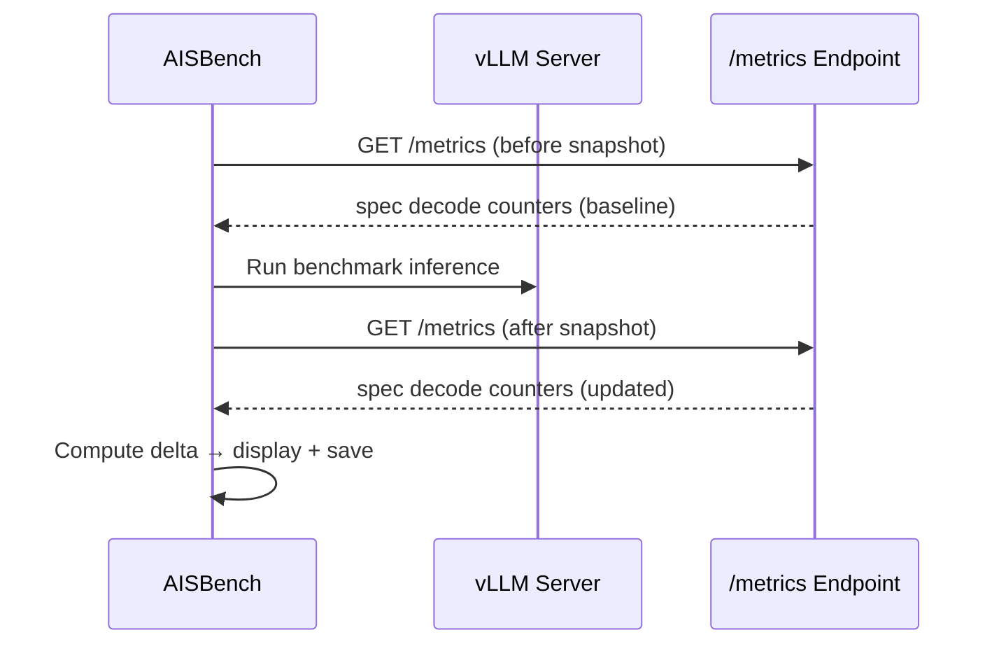

# Speculative Decoding Metrics Collection

## Overview

When running performance evaluation (`--mode perf`) against a vLLM-compatible inference server with speculative decoding enabled, AISBench can optionally collect server-side spec decode performance counters via the Prometheus `/metrics` endpoint. This provides **decoding efficiency metrics** (acceptance rate, acceptance length, per-position breakdown) that complement the standard request-level latency and throughput metrics.

The collection works by taking two snapshots of the Prometheus counters — one before and one after the benchmark inference — and computing the delta, isolating only the activity that occurred during the benchmark window.

---

## Prerequisites

1. **Inference server with speculative decoding enabled** — The server must serve a model with speculative decoding activated (e.g., N-gram, EAGLE, DSpark) and expose Prometheus metrics at `/metrics`.
2. **Prometheus endpoint accessible** — The `<host_ip>:<host_port>/metrics` endpoint must be reachable from the AISBench client machine.
3. **Network connectivity** — The client must be able to make HTTP GET requests to the metrics endpoint. If behind a proxy, set `HTTP_PROXY` / `HTTPS_PROXY` environment variables.

---

## Quick Start

Append `--spec-decode` to your `--mode perf` command:

```shell
ais_bench --models vllm_api_stream_chat \
          --datasets demo_gsm8k_gen_4_shot_cot_chat_prompt \
          --mode perf \
          --spec-decode
```

The metrics URL is resolved automatically from the model configuration (`host_ip` and `host_port` fields).

---

## How It Works



1. **Before snapshot**: AISBench fetches the current Prometheus counters before the benchmark starts.
2. **Benchmark run**: Standard inference benchmark executes.
3. **After snapshot**: AISBench fetches the counters again after the benchmark completes.
4. **Delta computation**: Differences between the two snapshots are calculated to derive spec decode metrics.
5. **Output**: Metrics are printed to console and saved as JSON under `outputs/<work_dir>/performances/spec_decode_<host>_<port>.json`.

---

## Metrics Explained

| Metric | Source (Prometheus Counter) | Description |
|--------|-----------------------------|-------------|
| **Drafts** | `vllm:spec_decode_num_drafts_total` | Number of draft-and-verify cycles during the benchmark window |
| **Draft tokens** | `vllm:spec_decode_num_draft_tokens_total` | Total candidate tokens proposed by the draft model |
| **Accepted tokens** | `vllm:spec_decode_num_accepted_tokens_total` | Total tokens accepted by the target model |
| **Acceptance rate (%)** | _(derived)_ | `(accepted_tokens / draft_tokens) × 100` |
| **Acceptance length** | _(derived)_ | `1 + (accepted_tokens / drafts)` — average tokens per forward pass |
| **Per-position rates** | `vllm:spec_decode_num_accepted_tokens_per_pos_total{position="N"}` | Acceptance rate at each draft position |

### Example Console Output

```
==================================================================
========== Speculative Decoding Metrics  [10.0.0.1:8080] ==========
==================================================================
Acceptance rate (%)                           99.26
Acceptance length                             5.96
Drafts                                        163
Draft tokens                                  815
Accepted tokens                               809
Per-position acceptance rates                 {0: 0.9939, 1: 0.9939, 2: 0.9939, 3: 0.9939, 4: 0.9877}
```

---

## Multi-Server Support

When your evaluation uses multiple models pointing to different inference servers, AISBench collects spec decode metrics from each unique `<host>:<port>` independently. A separate JSON result file is saved for each server.

---

## Error Handling

If the metrics endpoint is unreachable or the server has no spec decode counters, the console displays a "N/A" block with the reason:

```
====================================================================
========== Speculative Decoding Metrics  [10.0.0.1:8080] ==========
====================================================================
Status                                     N/A
Reason                                     [before] No spec decode metrics found on server; [after] No spec decode metrics found on server
```

The `[before]` / `[after]` prefixes in the Reason field indicate which collection phase the error occurred in (pre-inference baseline snapshot / post-inference snapshot). When both phases fail, each error is listed separately so you can tell which phase the failure belongs to.

This does **not** interrupt or fail the performance evaluation — spec decode collection is best-effort.

---

## JSON Output Format

Results are saved to `spec_decode_<host>_<port>.json` under the `performances/` directory:

```json
{
  "status": "ok",
  "url": "http://10.0.0.1:8080/metrics",
  "error": null,
  "data": {
    "num_drafts": 15420,
    "draft_tokens": 77100,
    "accepted_tokens": 50115,
    "acceptance_rate": 35.68627450980392,
    "acceptance_length": 2.784313725490196,
    "per_position_acceptance_rates": {"0": 0.6863, "1": 0.4706, "2": 0.3464, "3": 0.1895, "4": 0.0915}
  },
  "raw": {
    "before": { "num_drafts": 100, "num_draft_tokens": 500, ... },
    "after": { "num_drafts": 15520, "num_draft_tokens": 77600, ... }
  }
}
```

- `"status": "ok"` — metrics collected successfully.
- `"status": "na"` — metrics unavailable; check the `"error"` field for details.
- `"data"` — derived metrics (delta between before/after snapshots).
- `"raw"` — raw Prometheus counter values for debugging and traceability.
