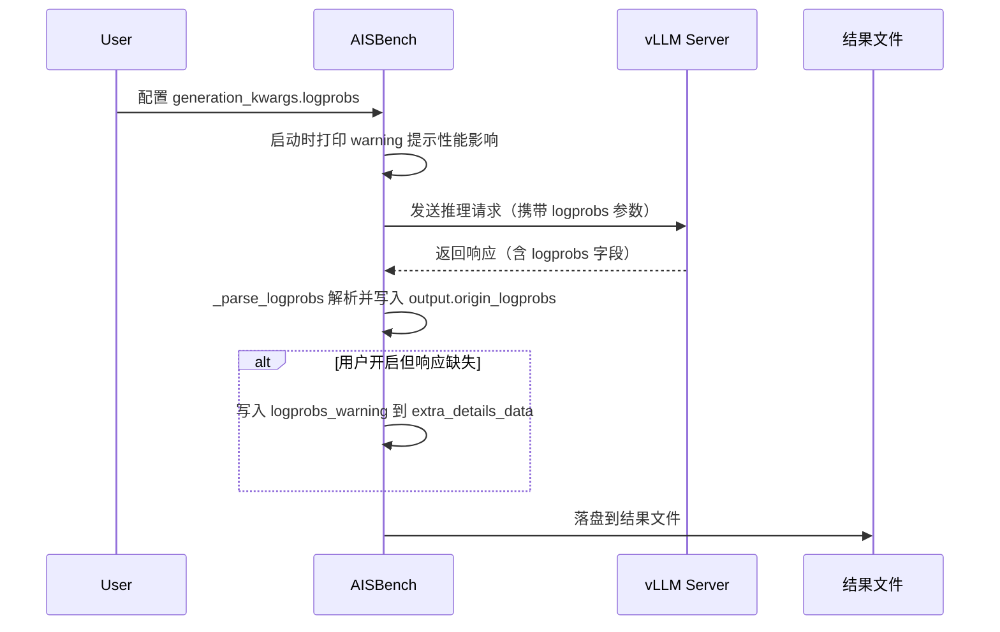

# Logprobs 采集与分析

## 概述

在精度评测（`--mode accuracy`）和性能评测（`--mode perf`）场景下，AISBench 支持通过模型配置的 `generation_kwargs` 开启 **token logprobs 采集**，将推理服务返回的 token 概率信息落盘到结果文件中，供后续数据集维度的后处理分析使用（如 avg/min/max/异常值统计、候选 token 分布分析等）。

采集的 logprobs 数据为 vLLM API 的原始响应格式，每项包含 token 文本、对数概率、字节序列以及 top 候选 token 分布。

---

## 前置条件

1. **推理后端为 vLLM 系列** — 当前仅支持 `VLLMCustomAPI`（completions API）和 `VLLMCustomAPIChat`（chat API）两种模型类型。
2. **非流式接口** — 需配置 `stream=False`，流式模式暂不支持 logprobs 采集。
3. **推理服务支持 logprobs** — 服务端 vLLM 版本需支持 `logprobs` / `top_logprobs` 参数。

> ⚠️ **支持范围**：其他 API 后端（TGI / Triton / Mindie 等）和本地模型（HF 等）暂不支持。后续按需扩展。

---

## 快速使用

在模型配置的 `generation_kwargs` 中增加 `logprobs` 参数即可启用：

```python
from ais_bench.benchmark.models import VLLMCustomAPIChat

models = [
    dict(
        type=VLLMCustomAPIChat,
        abbr='vllm-chat-logprobs',
        host_ip='127.0.0.1', host_port=8080,
        stream=False,                # 必须为非流式
        generation_kwargs=dict(
            temperature=0.6,
            top_p=0.95,
            logprobs=True,           # chat API: 开启 logprobs 采集
            top_logprobs=5,          # 可选：返回每 token 的 top 5 候选分布
        ),
    ),
]
```

### 参数说明

| 参数 | 适用 API | 类型 | 说明 |
|------|---------|------|------|
| `logprobs` | chat API | Bool | `True` 开启 logprobs 采集，`False` 关闭 |
| `logprobs` | completions API | Int | 返回的 top 候选数量，取值范围 `[0, 20]`，`0` 表示关闭，`>0` 表示开启并返回对应数量的候选 |
| `top_logprobs` | chat API | Int | 每 token 返回的 top 候选数量，取值范围 `[0, 20]`。**仅在 chat API 下需要单独配置**，completions API 由 `logprobs` 直接指定 |

> 💡 **区分两种 API 的参数语义**：chat API 的 `logprobs` 是布尔开关，`top_logprobs` 单独指定候选数；completions API 的 `logprobs` 本身就是整数，直接指定候选数，无需额外参数。

---

## 工作原理



1. **启动检查**：模型实例化时检查 `generation_kwargs` 是否开启 logprobs，若开启则打印 warning 提示性能影响。
2. **请求发送**：`generation_kwargs` 中的 logprobs 参数透传到推理服务请求体。
3. **响应解析**：`_parse_logprobs` 方法将 vLLM 响应中的 logprobs 字段解析为统一的嵌套结构，写入 `output.origin_logprobs`。
4. **异常告警**：若用户开启了 logprobs 但响应中缺失该字段，将告警信息写入 `output.extra_details_data["logprobs_warning"]`，避免误伤未开启 logprobs 的正常请求。
5. **结果落盘**：`origin_logprobs` 随结果文件输出，空列表会被过滤移除。

---

## 落盘数据结构

### 精度评测场景

落盘文件：`outputs/<work_dir>/predictions/<model_abbr>/<dataset>.jsonl`

每条 case 新增字段：

| 字段 | 类型 | 说明 |
|------|------|------|
| `input_tokens` | Int | 输入 token 数量 |
| `output_tokens` | Int | 输出 token 数量 |
| `origin_logprobs` | List[Dict\|None] | token logprobs 信息列表，未开启时该字段不落盘 |

### 性能评测场景

落盘文件：`outputs/<work_dir>/performance/<dataset>_details.jsonl`

每条 case 通过 `get_metrics()` 的 `to_dict()` 带出 `origin_logprobs` 字段，空列表会被过滤移除。

### origin_logprobs 数据格式

**chat API** 和 **completions API** 均统一为以下嵌套结构：

```json
[
    {
        "token": "Hello",
        "logprob": -0.5234,
        "bytes": [72, 101, 108, 108, 111],
        "top_logprobs": [
            {"token": "Hello", "logprob": -0.5234, "bytes": [72, 101, 108, 108, 111]},
            {"token": "Hi", "logprob": -2.1034, "bytes": [72, 105]}
        ]
    },
    null,
    {
        "token": "world",
        "logprob": -0.0012,
        "bytes": [119, 111, 114, 108, 100],
        "top_logprobs": []
    }
]
```

| 字段 | 类型 | 说明 |
|------|------|------|
| `token` | String | token 文本 |
| `logprob` | Float | 该 token 的对数概率 |
| `bytes` | List[Int] | token 的 UTF-8 字节序列（仅 chat API 返回，completions API 不含此字段） |
| `top_logprobs` | List[Dict] | top 候选 token 分布，每项含 `token` / `logprob` / `bytes`。未配置 `top_logprobs` 时为空数组 |

> ⚠️ **`null` 项含义**：token 序列首项的 `logprob` 可能为 `null`（表示 predefined token，无概率值）。保留 `null` 项以对齐 token 位置，便于后续按位置索引分析。

### logprobs_warning 字段

当用户开启了 logprobs 但推理服务响应中缺失该字段时，结果文件中会出现 `logprobs_warning` 字段（位于 `extra_details_data` 下）：

```json
{
    "extra_details_data": {
        "logprobs_warning": "logprobs is enabled in generation_kwargs but missing in response"
    }
}
```

**可能原因**：
- 推理服务版本不支持 logprobs 参数
- 请求参数被服务端忽略或过滤
- 后端模型类型与 logprobs 不兼容

> 💡 **设计说明**：logprobs 缺失不会触发请求重试（不同于 `error_info`），仅作为告警信息提示用户检查配置。

---

## 配置场景对照

| 配置 | chat API 落盘效果 | completions API 落盘效果 |
|------|------------------|------------------------|
| 未配置 logprobs | 无 `origin_logprobs` 字段 | 无 `origin_logprobs` 字段 |
| `logprobs=True`（chat）/ `logprobs=1`（completions） | `origin_logprobs` 含 token/logprob/bytes，`top_logprobs` 为空数组 | `origin_logprobs` 含 token/logprob，`top_logprobs` 为空数组 |
| `logprobs=True` + `top_logprobs=5`（chat）/ `logprobs=5`（completions） | `origin_logprobs` 含完整候选分布 | `origin_logprobs` 含完整候选分布 |

---

## 性能影响与注意事项

> ⚠️ **重要提示**：开启 logprobs 会显著增大响应体积，影响评测效率和内存占用。

### 响应体积估算

以 `max_out_len=4096` 为例：

| 配置 | 单条 response 估算大小 |
|------|----------------------|
| 不开 logprobs | 几 KB（仅 text + usage） |
| `logprobs=True`（无 top_logprobs） | ~200-400 KB（每 token 约 50-100B） |
| `logprobs=True` + `top_logprobs=20` | ~4-8 MB（每 token 约 1-2KB） |

### 风险点

| 风险 | 说明 |
|------|------|
| **内存峰值** | 响应解析过程中，`response.text()` + `json.loads` + `output.origin_logprobs` 三份副本同时在内存 |
| **并发放大** | worker loop 按 `batch_size` 并发，多请求并行持有大 response |
| **落盘放大** | 每条 case 的 jsonl 都写入完整 logprobs，磁盘占用线性增长 |
| **无 body 大小限制** | 当前 AISBench 在非流式场景下未约束 response body 大小 |

### 建议

1. **限制 `top_logprobs` 取值**（如 ≤5），这是响应膨胀的主要因素
2. **控制 `max_out_len` 与 `batch_size` 的乘积**，避免并发内存峰值过高
3. **优先使用小数据集验证**，确认服务端支持后再跑全量数据
4. **关注启动 warning**：AISBench 会在启动时打印 logprobs 性能影响提示
