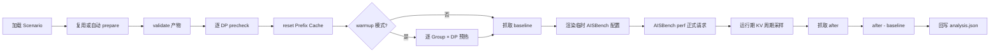
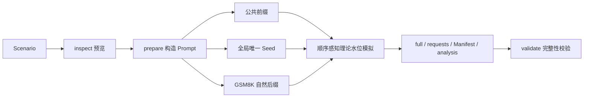

# Prefix Cache 数据生成、压测与命中率分析

## 概述

AISBench Prefix Cache 插件用于构造具有可控公共前缀的数据集，先计算理论 Prefix Cache 命中率，再通过 AISBench 和 vLLM 采集实际命中率。它适用于验证不同输入长度、公共前缀比例、Prefix Group、请求顺序以及单入口多 DP 对缓存命中率的影响。

当前插件提供五个命令：

- `inspect`：预览场景、可达范围和长度分布；
- `prepare`：生成正式请求、Manifest 和理论分析；
- `validate`：校验已有产物是否被修改、截断或换序；
- `run`：探活、reset、按组逐 DP 预热并运行 AISBench 正式压测；
- `analyze`：使用两份 Prometheus 快照离线复算实际命中率。

`inspect`、`prepare`、`validate` 完全离线；只有 `run` 连接 vLLM。当前支持一个 HTTP 入口及其内部单 DP 或多 DP，不支持多个独立推理服务实例。

---

## 前置条件

1. **Python 3.10 或更高版本**。
2. **可正常使用的 AISBench 仓库及依赖**。
3. **与目标 vLLM 服务一致的 tokenizer**。tokenizer 不一致会造成 token 长度、Block 边界和理论命中率偏差。
4. **GSM8K JSONL 语料**。每个非空行必须是 JSON 对象，并包含 Scenario 中 `corpus.field` 指定的文本字段，默认是 `question`。
5. **正确的 Prefix Cache Block 大小**。`tokenizer.block_size` 必须与目标服务实际值一致。
6. **在线 run 所需服务能力**：`/v1/completions`、`/metrics`、可选 `/reset_prefix_cache`，多 DP 时还需支持 `X-data-parallel-rank` 和分 DP `engine` 指标标签。

---

## 安装

以下命令假设当前目录是 AISBench 仓库根目录：

```shell
python -m venv .venv
source .venv/bin/activate
python -m pip install -e .
python -m pip install -e ./plugins/prefix_cache
ais-bench-prefix-cache --help
```

`-e` 表示 editable 安装，修改当前仓库源码后通常不需要重新安装。

---

## 快速使用

复制示例 Scenario：

```shell
cp ./plugins/prefix_cache/config_examples/scenario.example.json ./scenario.json
```

至少检查 `tokenizer.path`、`tokenizer.block_size` 和 `corpus.path`。需要模拟 cold 多 DP 路由或生成 warmup 计划时，还应让 `service.dp_size` 与目标服务一致。
执行在线压测前还要核对 `service` 下的 URL、`model` 以及 `aisbench.config`。

一个最小示例：

```json
{
  "schema_version": "1.0",
  "run": {
    "run_id": "gsm8k-prefix-cache-60",
    "random_seed": 42,
    "output_dir": "./outputs/gsm8k-prefix-cache-60"
  },
  "tokenizer": {
    "path": "/path/to/tokenizer",
    "block_size": 16
  },
  "corpus": {
    "path": "./GSM8K.jsonl",
    "field": "question",
    "selection": {"mode": "random"}
  },
  "requests": {
    "count": 100,
    "input_length": {"mode": "fixed", "value": 1024},
    "output_length": {"mode": "fixed", "value": 32}
  },
  "prefix_cache": {
    "mode": "warmup",
    "target_hit_rate": 0.6,
    "seed_blocks": 1,
    "groups": {"count": 1, "assignment": {"mode": "uniform"}},
    "order": {"strategy": "interleave"}
  },
  "service": {"dp_size": 2}
}
```

依次执行：

```shell
ais-bench-prefix-cache inspect --scenario ./scenario.json
ais-bench-prefix-cache prepare --scenario ./scenario.json
ais-bench-prefix-cache validate --manifest \
  ./outputs/gsm8k-prefix-cache-60_<时间戳>/result/gsm8k-prefix-cache-60_<时间戳>.manifest.json
ais-bench-prefix-cache run --scenario ./scenario.json
```

`run` 的正式 AISBench 请求默认使用 vLLM SSE 流式响应（`aisbench.model.stream=true`），按请求开始、首个响应 chunk 和后续 chunk 的时间点生成 TTFT、TPOT、ITL、E2EL 与吞吐量指标。设为 `false` 后仍可统计 Prefix Cache 命中率，但不能按 chunk 生成完整 TTFT、TPOT 和 ITL。探活和插件 warmup 使用 baseline 前的独立非流式请求，不进入正式性能统计。

已有 Prometheus 快照时，可在不连接 vLLM 的情况下复算：

```shell
ais-bench-prefix-cache analyze \
  --manifest <manifest路径> \
  --baseline ./baseline.prom \
  --after ./after.prom
```

---

## `run`：在线执行 Prefix Cache 压测

```shell
ais-bench-prefix-cache run --scenario ./scenario.json
ais-bench-prefix-cache run --scenario ./scenario.json --config ./my_prefix_cache_perf.py
```

`--scenario` 提供数据构造、服务、验证和 AISBench 参数。可选的 `--config` 只覆盖本次运行使用的 AISBench Python 模板，不修改 Scenario。`run` 会自动复用匹配的 inspect/prepared Manifest；目标时间戳目录中没有正式产物时会先执行 prepare。

完整在线时序如下：



各阶段的边界：

1. `precheck` 对每个 DP rank 发送探针并验证 queries、hits 和 KV 指标是否可解析；多 DP 请求使用 `X-data-parallel-rank` 定向路由。
2. `reset` 调用 `service.reset_url`。未配置或失败时，只有 `service.assume_empty_cache=true` 才会告警后继续。
3. warmup 模式按 Manifest 的计划预热每个 `Prefix Group × DP rank`。插件完成 warmup 后才抓取 baseline，因此 probe 和 warmup 产生的累计 counter 会被差分扣除。
4. 正式阶段把 Scenario 中的 `aisbench.dataset`、`aisbench.model`、工件路径和服务地址渲染为临时 Python 配置，再以 `perf` 模式启动 AISBench。期间按 `service.poll_interval_seconds` 采集 KV Cache 瞬时用量；设为 `0` 可关闭周期采样。
5. AISBench 成功结束后抓取 after，以 `after - baseline` 计算每 DP 和全局 queries、hits、实际命中率，并将理论/实际偏差写回 analysis。

插件 warmup 与 AISBench 自带的 `--num-warmups` 是两个独立机制。若要求 baseline 后只包含正式请求，应在 Scenario 中设置：

```json
"aisbench": {
  "extra_args": ["--num-warmups", "0"]
}
```

Prefix Cache 插件的阶段日志只写入 `log/<run_id>.run.log`；AISBench 子进程继承 stdout/stderr，进度和性能输出仍实时显示在终端。命令成功时 stdout 最终输出完整 analysis JSON；AISBench 返回非零退出码、服务能力不满足或工件校验失败时，`run` 返回错误。

---

## `analyze`：使用 Prometheus 快照离线复算

```shell
ais-bench-prefix-cache analyze \
  --manifest <manifest路径> \
  --baseline ./baseline.prom \
  --after ./after.prom
```

`analyze` 适合已有压测前后 `/metrics` 文本、需要重新套用当前解析规则或复核命中率的场景。它不连接 vLLM、不发送请求，也不启动 AISBench。

- `--manifest`：prepared Manifest；命令先校验 full/requests 行数、顺序和 SHA-256，再从 `effective_config.service` 读取 `dp_size`、`engine_label_map` 和告警阈值。
- `--baseline`：正式统计窗口开始前保存的完整 Prometheus 文本。
- `--after`：正式统计窗口结束后保存的完整 Prometheus 文本；queries/hits 是累计 counter，应不小于 baseline。

命令解析两个快照，按 DP 计算 queries/hits 差值，再汇总 `actual.global_hit_rate`，比较 `theoretical_hit_rate` 并生成 `ACTUAL_DEVIATION` 告警。结果以 `status="analyzed"` 写回 Manifest 所索引的 analysis 文件，`runtime` 只包含 `metrics_baseline` 和 `metrics_after`。离线快照没有正式运行期间的采样序列，因此不会生成 `runtime.kv_cache_polling` 或运行期 KV 均值/峰值；Prometheus 指标也没有 Prefix Group 标签，所以实际值只能按 DP 和全局统计，组级数据仍是理论值。

当前 CLI 将 `analyze` 与 `validate` 的插件日志写入同一个 `log/<run_id>.validate.log` 文件名，后执行的命令会重新创建该文件。stdout 返回更新后的完整 analysis JSON。目标或实际偏差只产生 `PASS_WITH_WARNING`，不改变原本成功的退出码。

---

## 工作原理



每条正式请求由三部分构成：

```text
公共前缀 + 全局唯一 seed + GSM8K 自然后缀
```

- 公共前缀按 `block_size` 对齐，是理论命中的主要来源；
- seed 长度为 `seed_blocks × block_size`，每条请求全局唯一，防止公共前缀之后继续误共享；
- 自然后缀从 GSM8K 问题中选择、拼接并截断，使非共享区保持自然语言形态。

插件根据目标全局命中率反求每条请求的公共前缀长度，并按照最终请求顺序模拟缓存水位。最终命中 token 总量优先精确匹配最近可达目标；在终值相同的方案中，warmup 均衡分配前缀，cold 按 Prefix Group/DP lane 水位优先选择累计率低超调、少回落并逐步贴近目标的方案。后置 lane 首次 miss 或容量不足时严格单调可能不可行，但不会再默认采用“前段明显冲高、尾部短前缀回调”的顺序填满方式。

---

## Scenario 核心配置

完整逐字段参考见 [Scenario 配置参数说明](../../../plugins/prefix_cache/config_examples/scenario.example.md)。

### 完整字段索引

| 配置路径 | 简短说明 |
|---|---|
| `schema_version` | Scenario 配置格式版本。 |
| `run` | 任务标识、随机性和输出控制。 |
| `run.run_id` | 任务名称；执行时会追加时间戳。 |
| `run.random_seed` | 数据生成和随机选择的全局种子。 |
| `run.output_dir` | Prefix Cache 产物基础目录。 |
| `run.overwrite` | 是否允许覆盖同名正式产物。 |
| `tokenizer` | Tokenizer 加载与 Block 配置。 |
| `tokenizer.path` | Tokenizer 模型或目录路径。 |
| `tokenizer.block_size` | Prefix Cache 的 token Block 大小。 |
| `tokenizer.revision` | Tokenizer 仓库版本；`null` 表示默认版本。 |
| `tokenizer.trust_remote_code` | 是否信任 Tokenizer 自定义代码。 |
| `corpus` | 自然后缀语料配置。 |
| `corpus.path` | GSM8K JSONL 文件路径。 |
| `corpus.field` | JSONL 中的问题文本字段名。 |
| `corpus.selection` | GSM8K 样本选择规则。 |
| `corpus.selection.mode` | 选择模式：随机、行号、哈希或混合。 |
| `corpus.selection.values` | 非 mixed 模式的行号或哈希值列表。 |
| `corpus.selection.indices` | mixed 模式的零基行号列表。 |
| `corpus.selection.question_sha256` | mixed 模式的问题 SHA-256 列表。 |
| `requests` | 正式请求数量和长度分布。 |
| `requests.count` | 正式请求总数。 |
| `requests.input_length` | 输入 token 长度生成规则。 |
| `requests.input_length.mode` | 输入长度模式。 |
| `requests.input_length.value` | fixed 模式的固定长度。 |
| `requests.input_length.values` | explicit 模式的长度列表。 |
| `requests.input_length.ranges` | range 模式的区间列表。 |
| `requests.input_length.ranges[].min` | 单个采样区间下界。 |
| `requests.input_length.ranges[].max` | 单个采样区间上界。 |
| `requests.input_length.ranges[].count` | 单个区间生成的请求数。 |
| `requests.input_length.min` | 截断正态分布下界。 |
| `requests.input_length.max` | 截断正态分布上界。 |
| `requests.input_length.mean` | 截断正态分布均值。 |
| `requests.input_length.std` | 截断正态分布标准差。 |
| `requests.input_length.path` | csv 模式的长度文件路径。 |
| `requests.output_length` | 最大输出 token 长度生成规则。 |
| `requests.output_length.mode` | 输出长度模式。 |
| `requests.output_length.value` | fixed 模式的固定长度。 |
| `requests.output_length.min` | uniform/截断正态分布下界。 |
| `requests.output_length.max` | uniform/截断正态分布上界。 |
| `requests.output_length.mean` | 截断正态分布均值。 |
| `requests.output_length.std` | 截断正态分布标准差。 |
| `requests.output_length.path` | csv 模式的长度文件路径。 |
| `output` | 精简请求文件的字段控制。 |
| `output.output_key` | 可选输出长度字段名；`null` 表示不输出。 |
| `prefix_cache` | Prefix Cache 数据和运行策略。 |
| `prefix_cache.mode` | 缓存模式：`cold` 或 `warmup`。 |
| `prefix_cache.target_hit_rate` | 期望的全局 Prefix Cache 命中率。 |
| `prefix_cache.seed_blocks` | 每条请求唯一 seed 占用的 Block 数。 |
| `prefix_cache.minimum_non_shared_length` | 每条请求至少保留的非共享 token 数。 |
| `prefix_cache.groups` | Prefix Group 数量、分配和覆盖配置。 |
| `prefix_cache.groups.count` | Prefix Group 总数。 |
| `prefix_cache.groups.assignment` | 请求到 Group 的分配规则。 |
| `prefix_cache.groups.assignment.mode` | Group 分配模式。 |
| `prefix_cache.groups.assignment.exponent` | Zipf 分布热点指数。 |
| `prefix_cache.groups.assignment.weights` | weights 模式的各组相对权重。 |
| `prefix_cache.groups.overrides` | 各 Group 的可选独立覆盖。 |
| `prefix_cache.groups.overrides.group-N.input_length` | 指定 Group 的输入长度规则。 |
| `prefix_cache.groups.overrides.group-N.output_length` | 指定 Group 的输出长度规则。 |
| `prefix_cache.groups.overrides.group-N.corpus_selection` | 指定 Group 的语料选择规则。 |
| `prefix_cache.order` | 正式请求排列规则。 |
| `prefix_cache.order.strategy` | 顺序、交错、打乱或长度升序策略。 |
| `service` | 在线推理服务与指标采集配置。 |
| `service.inference_url` | vLLM 推理接口地址。 |
| `service.metrics_url` | Prometheus 指标接口地址。 |
| `service.reset_url` | Prefix Cache 重置接口地址。 |
| `service.model` | 请求体中的服务模型名。 |
| `service.dp_size` | 单实例内部 DP rank 数量。 |
| `service.assume_empty_cache` | 无重置接口时是否假定缓存为空。 |
| `service.engine_label_map` | Prometheus engine 标签到 DP rank 的映射。 |
| `service.timeout_seconds` | 探活、预热和指标请求超时秒数。 |
| `service.api_key` | 推理服务鉴权密钥；不会明文落盘。 |
| `service.poll_interval_seconds` | 正式压测期间 KV 指标采样间隔。 |
| `validation` | 结果偏差告警阈值。 |
| `validation.target_warning_pp` | 理论值偏离目标的告警百分点。 |
| `validation.actual_warning_pp` | 实际值偏离理论值的告警百分点。 |
| `aisbench` | AISBench 正式压测启动配置。 |
| `aisbench.config` | AISBench Python 配置模板路径。 |
| `aisbench.work_dir` | AISBench 结果基础目录。 |
| `aisbench.extra_args` | 追加到 AISBench 命令的参数列表。 |
| `aisbench.dataset` | Dataset reader 和 Prompt 映射配置。 |
| `aisbench.dataset.abbr` | Dataset 展示简称；`null` 时自动生成。 |
| `aisbench.dataset.input_columns` | Dataset reader 的输入列。 |
| `aisbench.dataset.output_column` | Dataset reader 的参考答案列。 |
| `aisbench.dataset.prompt_template` | 正式请求的 Prompt 模板。 |
| `aisbench.dataset.pred_role` | 预测结果的角色名称。 |
| `aisbench.model` | AISBench API Model 配置。 |
| `aisbench.model.abbr` | Model 展示简称；`null` 时自动生成。 |
| `aisbench.model.attr` | 模型属性；当前必须为 `service`。 |
| `aisbench.model.stream` | 是否使用 SSE 流式响应。 |
| `aisbench.model.max_out_len` | Model 层的兜底最大输出长度。 |
| `aisbench.model.retry` | API 请求失败重试次数。 |
| `aisbench.model.batch_size` | AISBench API 最大并发基值。 |
| `aisbench.model.generation_kwargs` | 透传给 vLLM 的生成参数。 |

Scenario 会拒绝白名单之外的字段。离线计算使用 `service.dp_size`；`run` 使用服务 URL、model、reset/空缓存策略、指标映射、超时、API key 以及整个 `aisbench` 段。

### 输入和输出长度

`requests.input_length` 支持：

- `fixed`：固定长度；
- `explicit`：显式长度列表；
- `range`：一个或多个闭区间采样；
- `truncated_normal`：截断正态分布；
- `csv`：从 CSV 的 `input_prompt_tokens`、`content_tokens` 或 `input_tokens` 列读取。

`requests.output_length` 支持：

- `fixed`；
- `uniform`；
- `truncated_normal`；
- `csv`，列名必须为 `output_tokens`。

所有长度必须为正整数。全局显式列表、range 计数和 CSV 行数必须等于 `requests.count`；组级覆盖时必须等于该组实际请求数。

### GSM8K 样本选择

`corpus.selection.mode` 支持：

- `random`：根据 `run.random_seed` 确定性打乱；
- `indices`：按 GSM8K 零基行号选择；
- `question_sha256`：按规范化 question 的 SHA-256 选择；
- `mixed`：先加入 `indices`，再加入 `question_sha256`。

指定样本不足时会按已选顺序循环复用。mixed 模式的两个列表不能同时为空。

### Prefix Group

`prefix_cache.groups.assignment.mode` 支持：

- `uniform`：尽量均匀分配；
- `zipf`：使用 `exponent` 控制热点集中程度；
- `weights`：通过 `weights` 提供每组相对权重。

每个 Prefix Group 独立生成 canonical 前缀、维护缓存水位并统计理论命中率。`groups.overrides.group-N` 可以独立覆盖输入长度、输出长度和语料选择方式。

### requests.jsonl 输出字段

```json
"output": {"output_key": null}
```

默认 `null` 时每行只有 `question`、`answer`。也可配置 `"max_tokens"` 或 `"output_tokens"` 作为第三字段名；两者的值都来自内部最大输出 token 数。`full.jsonl.max_tokens` 始终保留，AISBench 从 full 读取生成长度，因此默认省略不影响运行。

### 请求顺序

`prefix_cache.order.strategy` 支持：

- `sequential`；
- `within_group_shuffle`；
- `interleave`；
- `global_shuffle`；
- `input_len_asc`。

理论命中率始终按重排后的最终发送顺序计算。要模拟“无预热、短请求到长请求逐步建立 Cache”，请同时使用 `prefix_cache.mode="cold"` 和 `order.strategy="input_len_asc"`。prepare 会先按组内输入长度升序生成产物；run 时 `LaneSequencer` 保证每个 `(group_id, dp_rank)` lane 只有在前一条请求完成后才放行下一条。不同 Group/DP 的独立 Cache 仍可并行。

---

## cold 与 warmup

### cold

- 每个 `(group_id, dp_rank)` lane 从零缓存水位开始；
- 同一组的正式请求按组内出现顺序 round-robin 路由到各 DP rank；
- `full.jsonl` 记录 `dp_rank` 和 `lane_sequence`；
- 理论命中率按每个 lane 独立模拟后进行 token 加权汇总。

### warmup

- 为每个 `Prefix Group × DP rank` 生成一条预热计划；
- 预热计划写入 Manifest 的 `warmup.plan`；
- warmup 请求不写入 `requests.jsonl`，不进入正式请求数量和理论统计分母；
- `prepare` 只生成预热计划；`run` 会在正式 baseline 之前把计划逐 `Prefix Group × DP rank` 定向发送。

---

## 理论命中率和可达性

对于某个独立缓存 lane，请求到达前水位为 `watermark`，请求共享前缀为 `shared_prefix_tokens`，理论命中 token 为：

```text
hit_tokens = min(shared_prefix_tokens, watermark)
watermark_after = max(watermark, shared_prefix_tokens)
```

全局命中率使用 token 加权口径：

```text
global_hit_rate = sum(theoretical_hit_tokens) / sum(actual_input_tokens)
```

插件同时输出：

- `requested_target_hit_rate`：Scenario 请求目标；
- `effective_target_hit_rate`：求解器选择的最近可达目标；
- `theoretical_hit_rate`：按最终顺序模拟的理论值；
- `reachable_min`、`reachable_max`：当前约束下的理论范围；
- `target_reachable`：请求目标是否位于可达范围内。

Block 对齐、唯一 seed、自然后缀、Prefix Group、顺序和 cold DP lane 都可能使某个目标不可达。

---

## 输出目录和时间戳

时间戳格式为 `_YYYYMMDD_HHMMSS`。推荐工作流中，inspect 创建时间戳和轻量 Manifest，prepare 与 run 通过 Manifest 复用该任务：

```text
outputs/gsm8k-prefix-cache-60_20260825_123456/
├── log/
│   ├── gsm8k-prefix-cache-60_20260825_123456.inspect.log
│   ├── gsm8k-prefix-cache-60_20260825_123456.prepare.log
│   ├── gsm8k-prefix-cache-60_20260825_123456.validate.log
│   └── gsm8k-prefix-cache-60_20260825_123456.run.log
└── result/
    ├── gsm8k-prefix-cache-60_20260825_123456.full.jsonl
    ├── gsm8k-prefix-cache-60_20260825_123456.requests.jsonl
    ├── gsm8k-prefix-cache-60_20260825_123456.manifest.json
    └── gsm8k-prefix-cache-60_20260825_123456.analysis.json
```

不会再生成 `<output_dir>.inspect.json`。inspect 将摘要写入时间戳目录的 `result/<run_id_时间戳>.manifest.json`，状态为 `inspected`；prepare 在 Scenario SHA-256、run/output 和状态均匹配时原位升级为 `prepared`，run 可继续复用。Scenario 内容改变后旧 Manifest 会自动失配。

---

## 产物说明

| 产物 | 作用 |
|---|---|
| `full.jsonl` | 完整审计数据，包括组、DP lane、输入长度、公共前缀、唯一 seed、GSM8K 来源、理论水位和碰撞状态。 |
| `requests.jsonl` | 最小 AISBench 请求；默认只有 `question`、`answer`，可由 `output.output_key` 追加 `max_tokens` 或 `output_tokens`。 |
| `manifest.json` | 有效配置、输入哈希、tokenizer 指纹、长度分布、可达范围、组、DP、warmup 和产物哈希。 |
| `analysis.json` | requested/effective/theoretical/actual 命中率、baseline/after、理论分组统计、理论/实际分 DP 统计、偏差与 warnings。 |

`service.api_key` 明文不会写入 Manifest，只记录 `api_key_configured`。

固定字段索引如下。标为“可选”或“阶段性”的字段只在对应配置或执行阶段出现。

### `requests.jsonl` 字段

| 字段 | 简短说明 |
|---|---|
| `question` | 发送给模型的完整 Prompt。 |
| `answer` | AISBench 使用的参考答案。 |
| `max_tokens` | 可选的最大输出 token 数。 |
| `output_tokens` | `max_tokens` 的可选别名。 |

`max_tokens` 和 `output_tokens` 由 `output.output_key` 二选一追加；默认都不出现。

### `full.jsonl` 字段

| 字段 | 简短说明 |
|---|---|
| `request_id` | 全局唯一的请求标识。 |
| `sequence_index` | 最终发送顺序中的全局序号。 |
| `group_id` | 请求所属 Prefix Group。 |
| `occurrence_index_within_group` | 请求在组内的出现序号。 |
| `dp_rank` | cold 模式下的目标 DP rank。 |
| `lane_sequence` | `(group_id, dp_rank)` lane 内序号。 |
| `target_input_tokens` | 配置期望的输入 token 数。 |
| `actual_input_tokens` | Tokenizer 验证后的实际输入 token 数。 |
| `max_tokens` | 该请求允许生成的最大 token 数。 |
| `shared_prefix_tokens` | 可复用公共前缀的 token 数。 |
| `seed_tokens` | 全局唯一 seed 的 token 数。 |
| `natural_suffix_tokens` | 自然后缀的 token 数。 |
| `question` | 公共前缀、seed 和后缀组成的完整 Prompt。 |
| `answer` | AISBench 参考答案。 |
| `gsm_indices` | 自然后缀使用的 GSM8K 零基行号。 |
| `gsm_hashes` | 自然后缀对应问题的 SHA-256。 |
| `canonical_prefix_sha256` | 所属组 canonical 前缀摘要。 |
| `seed_sha256` | 当前请求唯一 seed 摘要。 |
| `request_random_seed` | 当前请求派生出的随机种子。 |
| `watermark_before` | 请求前该缓存 lane 的模拟水位。 |
| `theoretical_hit_tokens` | 当前请求理论命中的 token 数。 |
| `watermark_after` | 请求后该缓存 lane 的模拟水位。 |
| `theoretical_hit_rate` | 当前请求理论命中率。 |
| `divergence_block_sha256` | 用于验证分歧 Block 的摘要。 |
| `divergence_unique` | 分歧 Block 是否全局唯一。 |
| `collision_status` | 前缀或 seed 碰撞检查结果。 |

### `manifest.json` 顶层字段

| 字段 | 简短说明 |
|---|---|
| `schema_version` | Manifest 数据结构版本。 |
| `plugin_version` | 生成产物的插件版本。 |
| `status` | `inspected` 或 `prepared` 状态。 |
| `run_id` | 带执行时间戳的任务标识。 |
| `scenario_path` | 原始 Scenario 文件路径。 |
| `scenario_sha256` | 原始 Scenario 文件摘要。 |
| `effective_config` | 补齐默认值后的有效配置。 |
| `effective_config_sha256` | 有效配置摘要。 |
| `corpus_sha256` | GSM8K 语料文件摘要。 |
| `tokenizer` | Tokenizer 身份和 Block 信息。 |
| `requests` | 请求数、总 token 和长度摘要。 |
| `prefix_cache` | 模式、命中率和可达性结果。 |
| `groups` | 每个 Prefix Group 的独立统计。 |
| `dp` | DP 数量和 cold 路由策略。 |
| `warmup` | Group × DP 预热计划。 |
| `divergence` | seed/分歧块唯一性汇总。 |
| `artifacts` | 各产物路径、大小和摘要。 |
| `inspect` | inspect-only Manifest 的预览信息。 |

正式 Manifest 使用除 `inspect` 外的上述字段；inspect-only Manifest 的 `status="inspected"`，并在 `inspect.summary` 中保存预览结果。

### `analysis.json` 顶层字段

| 字段 | 简短说明 |
|---|---|
| `schema_version` | Analysis 数据结构版本。 |
| `run_id` | 对应的带时间戳任务标识。 |
| `status` | `prepared` 或 `complete` 状态。 |
| `requested_target_hit_rate` | Scenario 请求的目标命中率。 |
| `effective_target_hit_rate` | 求解器选择的最近可达目标。 |
| `theoretical_hit_rate` | 按最终顺序模拟的理论命中率。 |
| `target_difference_pp` | 理论值与目标的绝对百分点差。 |
| `target_signed_difference_pp` | 理论值减目标值的带符号百分点差。 |
| `target_absolute_difference_pp` | 理论值与目标的绝对百分点差。 |
| `validation` | 可达性、状态和告警策略。 |
| `theory` | 理论 token、Group 和 DP 统计。 |
| `warnings` | 本次产生的告警列表。 |
| `runtime` | run 阶段、预热和指标快照信息。 |
| `actual` | 指标差分得到的实际命中统计。 |
| `theory_actual_difference_pp` | 实际值与理论值的绝对百分点差。 |
| `theory_actual_signed_difference_pp` | 实际值减理论值的带符号百分点差。 |
| `theory_actual_absolute_difference_pp` | 实际值与理论值的绝对百分点差。 |

`runtime`、`actual` 和三个 `theory_actual_*` 字段由 run/analyze 阶段追加。

### inspect stdout 字段

| 字段 | 简短说明 |
|---|---|
| `run_id` | Scenario 中未追加时间戳的任务名。 |
| `mode` | `cold` 或 `warmup` 模式。 |
| `requested_target_hit_rate` | 用户请求的目标命中率。 |
| `effective_target_hit_rate` | 最近可达目标命中率。 |
| `theoretical_hit_rate` | 预计理论命中率。 |
| `reachable_min` | 全局最小可达命中率。 |
| `reachable_max` | 全局最大可达命中率。 |
| `target_reachable` | 请求目标是否处于可达区间。 |
| `group_reachability` | 各 Group 的可达范围。 |
| `groups` | 各 Group 的请求数量。 |
| `input_tokens` | 输入长度统计和总 token 数。 |
| `output_tokens` | 输出长度统计和总 token 数。 |
| `dp_route_counts` | 各 DP rank 的正式请求数。 |
| `sends_requests` | 是否发送在线请求；inspect 固定为 false。 |
| `log` | inspect 日志文件路径。 |
| `manifest` | inspect-only Manifest 文件路径。 |

各字段类型和嵌套含义以 [Prefix Cache 插件 README](../../../plugins/prefix_cache/README.md) 与 [Scenario 完整字段说明](../../../plugins/prefix_cache/config_examples/scenario.example.md) 为准。

---

## 告警与退出码

| 告警 | 条件 |
|---|---|
| `TARGET_UNREACHABLE` | 请求目标不在 `[reachable_min, reachable_max]` 内。 |
| `TARGET_DEVIATION` | 理论值与请求目标的绝对差超过 `validation.target_warning_pp`。 |
| `ACTUAL_DEVIATION` | 实际值与理论值的绝对差超过 `validation.actual_warning_pp`。 |

这些告警只把展示状态改为 `PASS_WITH_WARNING`；`warning_only=true`、`affects_exit_code=false`，不会改变成功退出码。Scenario、产物、服务能力或 AISBench 执行错误才返回非零退出码。

---

## 常见问题

### 为什么理论命中率没有精确等于目标？

公共前缀必须按 Block 对齐，同时还要为唯一 seed 和自然后缀预留空间。cold 模式还受首次 miss、请求顺序、组和 DP lane 水位约束。请先运行 `inspect`，检查 `reachable_min`、`reachable_max` 和 `target_reachable`。

### 为什么 warmup 不进入正式统计？

warmup 只负责建立缓存。如果计入正式请求数、吞吐、时延或命中率，结果会混入准备阶段成本。

### 为什么 prepare 报同名文件已存在？

prepare 可能复用了已有正式产物的 inspect 时间戳。重新执行 `inspect` 可获得新时间戳；只有明确要重建同一目录时才使用：

```shell
ais-bench-prefix-cache prepare --scenario ./scenario.json --overwrite
```

### 为什么 tokenizer round-trip 失败？

插件要求 canonical 前缀、seed 和最终 prompt 在 tokenizer 编解码后保持一致。请确认 tokenizer 文件完整、`trust_remote_code` 设置正确，并与目标服务使用同一 tokenizer 版本。

---

## 当前范围

- 支持单个 HTTP 入口对应的多 DP 数据规划；
- 不支持多个独立推理服务实例；
- `run` 支持每个 Prefix Group × 每个 DP 独立预热、正式 AISBench 压测与 Prometheus 指标采集；warmup 在 baseline 之前完成，不进入正式统计；
- `analyze` 支持用保存的 baseline/after `.prom` 文件离线复算；
- 详细配置和全部 JSON 字段契约以 [Prefix Cache 插件 README](../../../plugins/prefix_cache/README.md) 与 [Scenario 完整字段说明](../../../plugins/prefix_cache/config_examples/scenario.example.md) 为准。
