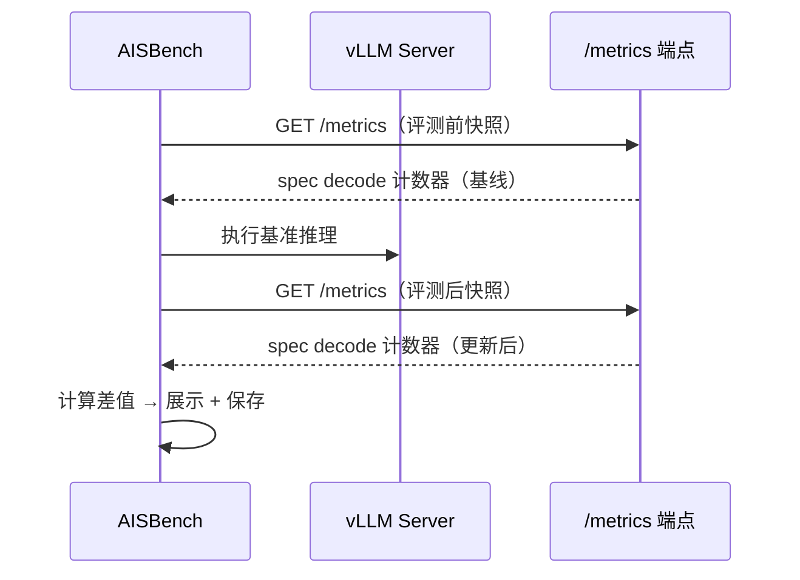

# 投机推理指标采集

## 概述

在对启用了投机推理（Speculative Decoding）的 vLLM 兼容推理服务进行性能评测（`--mode perf`）时，AISBench 可以通过 Prometheus `/metrics` 端点额外采集服务端的投机推理性能计数器。这样可以在标准请求级延迟和吞吐指标之外，得到**解码效率指标**（采纳率、采纳长度、逐位置明细）。

采集方式是在基准推理前后各拉取一次 Prometheus 计数器快照，计算差值，从而仅反映评测窗口内的活动。

---

## 前置条件

1. **推理服务已开启投机推理** — 服务端需部署开启了投机推理的模型（如 N-gram、EAGLE、DSpark），并暴露 Prometheus `/metrics` 端点。
2. **Prometheus 端点可访问** — `<host_ip>:<host_port>/metrics` 端点需在 AISBench 客户端机器上可达。
3. **网络连通** — 客户端需能对 metrics 端点发起 HTTP GET 请求。若在代理环境下，请设置 `HTTP_PROXY` / `HTTPS_PROXY` 环境变量。

---

## 快速使用

在 `--mode perf` 命令后追加 `--spec-decode`：

```shell
ais_bench --models vllm_api_stream_chat \
          --datasets demo_gsm8k_gen_4_shot_cot_chat_prompt \
          --mode perf \
          --spec-decode
```

metrics URL 会从模型配置的 `host_ip` 和 `host_port` 字段自动解析。

---

## 工作原理



1. **评测前快照**：AISBench 在基准评测开始前拉取 Prometheus 计数器。
2. **基准推理**：执行标准性能评测。
3. **评测后快照**：评测完成后再次拉取计数器。
4. **差值计算**：基于两次快照的差值计算投机推理指标。
5. **结果输出**：指标输出到控制台，同时保存为 JSON 文件至 `outputs/<work_dir>/performances/spec_decode_<host>_<port>.json`。

---

## 指标说明

| 指标 | 来源（Prometheus 计数器） | 说明 |
|------|---------------------------|------|
| **Drafts** | `vllm:spec_decode_num_drafts_total` | 评测窗口内的草稿-验证循环次数 |
| **Draft tokens** | `vllm:spec_decode_num_draft_tokens_total` | 草稿模型生成的候选 Token 总数 |
| **Accepted tokens** | `vllm:spec_decode_num_accepted_tokens_total` | 被目标模型采纳的 Token 总数 |
| **Acceptance rate (%)** | _(推导)_ | `(被采纳 Token 数 / 草稿 Token 数) × 100` |
| **Acceptance length** | _(推导)_ | `1 + (被采纳 Token 数 / 草稿次数)` — 每次前向推理平均采纳 Token 数 |
| **Per-position rates** | `vllm:spec_decode_num_accepted_tokens_per_pos_total{position="N"}` | 每个草稿位置的采纳率 |

### 控制台输出示例

```
==================================================================
========== Speculative Decoding Metrics  [10.0.0.1:8080] ==========
==================================================================
Acceptance rate (%)                           99.26
Acceptance length                             5.96
Drafts                                        163
Draft tokens                                  815
Accepted tokens                               809
Per-position acceptance rates                 {0: 0.9939, 1: 0.9939, 2: 0.9939, 3: 0.9939, 4: 0.9877}
```

---

## 多服务支持

当评测涉及多个模型指向不同推理服务时，AISBench 会对每个唯一的 `<host>:<port>` 组合独立采集投机推理指标，并分别保存 JSON 结果文件。

---

## 异常处理

若 metrics 端点不可达或服务端未开启投机推理，控制台会显示 N/A 块及原因说明：

```
====================================================================
========== Speculative Decoding Metrics  [10.0.0.1:8080] ==========
====================================================================
Status                                     N/A
Reason                                     [before] No spec decode metrics found on server; [after] No spec decode metrics found on server
```

Reason 中的 `[before]` / `[after]` 前缀标识错误来源的采集阶段（推理前基线采集 / 推理后采集）；两阶段都失败时分别列出，便于定位是哪个阶段开始出现异常。

这**不会**中断性能评测流程 — 投机推理指标采集采用尽力而为策略。

---

## JSON 输出格式

结果保存到 `performances/` 目录下的 `spec_decode_<host>_<port>.json`：

```json
{
  "status": "ok",
  "url": "http://10.0.0.1:8080/metrics",
  "error": null,
  "data": {
    "num_drafts": 15420,
    "draft_tokens": 77100,
    "accepted_tokens": 50115,
    "acceptance_rate": 35.68627450980392,
    "acceptance_length": 2.784313725490196,
    "per_position_acceptance_rates": {"0": 0.6863, "1": 0.4706, "2": 0.3464, "3": 0.1895, "4": 0.0915}
  },
  "raw": {
    "before": { "num_drafts": 100, "num_draft_tokens": 500, ... },
    "after": { "num_drafts": 15520, "num_draft_tokens": 77600, ... }
  }
}
```

- `"status": "ok"` — 指标采集成功。
- `"status": "na"` — 指标不可用，查看 `"error"` 字段了解原因。
- `"data"` — 推导指标（before/after 快照差值）。
- `"raw"` — 原始 Prometheus 计数器数值，用于调试和可追溯性。
