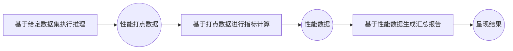

# 服务化性能测评指南
## 简介
AISBench Benchmark 提供服务化性能测评能力。针对流式推理场景，通过精确记录每条请求的发送时间、各阶段返回时间及响应内容，系统地评估模型服务在实际部署环境中的响应延迟（如 TTFT、Token间延迟）、吞吐能力（如 QPS、TPUT）、并发处理能力等关键性能指标。

用户可通过配置服务化后端参数，灵活控制请求内容、请求间隔、并发数量等，适配不同评测场景（如低并发延迟敏感型、高并发吞吐优先型等）。测评支持自动化执行并输出结构化结果，便于横向对比不同模型、部署方案、硬件配置下的服务性能差异。
## 服务化性能测评快速入门
### 命令含义
AISBench服务化性能测评命令含义与📚 [工具快速入门/启动测评（两种方式任选其一）](../../get_started/quick_start.md#启动测评两种方式任选其一)中的解释相同。在此基础上需要额外加上`--mode perf`或`-m perf`来进入性能评测场景。

### 执行命令示例

::::{tab-set}
:::{tab-item} ⭐ 推荐：使用自定义配置文件

完成配置后，执行命令启动服务化性能评测：

```bash
ais_bench ais_bench/configs/performance_benchmark/single_task_zh_cn.py --mode perf
```

:::
:::{tab-item} 备选：使用命令行参数

修改好配置文件后，执行命令启动服务化性能评测：

```bash
ais_bench --models vllm_api_stream_chat --datasets demo_gsm8k_gen_4_shot_cot_chat_prompt -m perf
```

:::
::::
#### 查看任务执行细节
执行AISBench命令后，正在执行的任务状态会在命令行实时刷新的看板上显示（键盘按"P"键可以停止刷新，用于复制看板信息，再按"P"可以继续刷新），例如：
```
Base path of result&log : outputs/default/20251106_103326
Task Progress Table (Updated at: 2025-11-06 10:34:41)
Page: 1/1  Total 2 rows of data
Press Up/Down arrow to page,  'P' to PAUZE/RESUME screen refresh, 'Ctrl + C' to exit

+---------------------------------+-----------+-------------------------------------------------+-------------+-------------+------------------------------------------------+------------------------------------------------+
| Task Name                       |   Process | Progress                                        | Time Cost   | Status      | Log Path                                       | Extend Parameters                              |
+=================================+===========+=================================================+=============+=============+================================================+================================================+
| vllm-api-stream-chat/demo_gsm8k |    744887 | [###########                   ] 3/8 [0.1 it/s] | 0:00:54     | inferencing | logs/infer/vllm-api-stream-chat/demo_gsm8k.out | {'POST': 4, 'RECV': 3, 'FINISH': 3, 'FAIL': 0} |
+---------------------------------+-----------+-------------------------------------------------+-------------+-------------+------------------------------------------------+------------------------------------------------+
`

```

任务执行的细节日志会不断落盘在默认的输出路径，这个输出路径在实时刷新的看板上显示，即`Log Path`。`Log Path`（`logs/infer/vllm-api-stream-chat/demo_gsm8k.out`）是在`Base path`（`outputs/default/20251106_103326`）下的路径，以上述的看板信息为例，任务执行的详细日志路径为：
```shell
# {Base path}/{Log Path}
outputs/default/20251106_103326/logs/infer/vllm-api-stream-chat/demo_gsm8k.out
```

> 💡 如果希望执行过程中将详细日志直接打印，执行命令时可以加上 `--debug`:
`ais_bench --models vllm_api_stream_chat --datasets demo_gsm8k_gen_4_shot_cot_chat_prompt -m perf --debug`

### 查看性能结果
性能结果打屏示例如下：

```bash
[2025-11-06 10:35:43,667] [ais_bench] [INFO] Performance Results of task: vllm-api-stream-chat/demo_gsm8k:
╒══════════════════════════╤═════════╤═════════════════╤═════════════════╤═════════════════╤═════════════════╤═════════════════╤═════════════════╤═════════════════╤═════╕
│ Performance Parameters   │ Stage   │ Average         │ Min             │ Max             │ Median          │ P75             │ P90             │ P99             │  N  │
╞══════════════════════════╪═════════╪═════════════════╪═════════════════╪═════════════════╪═════════════════╪═════════════════╪═════════════════╪═════════════════╪═════╡
│ E2EL                     │ total   │ 12300.2 ms      │ 12295.9 ms      │ 12305.2 ms      │ 12300.0 ms      │ 12302.1 ms      │ 12304.3 ms      │ 12305.1 ms      │  8  │
├──────────────────────────┼─────────┼─────────────────┼─────────────────┼─────────────────┼─────────────────┼─────────────────┼─────────────────┼─────────────────┼─────┤
│ TTFT                     │ total   │ 2006.0 ms       │ 2005.1 ms       │ 2007.4 ms       │ 2006.1 ms       │ 2006.2 ms       │ 2006.6 ms       │ 2007.3 ms       │  8  │
├──────────────────────────┼─────────┼─────────────────┼─────────────────┼─────────────────┼─────────────────┼─────────────────┼─────────────────┼─────────────────┼─────┤
│ TPOT                     │ total   │ 20.1 ms         │ 20.1 ms         │ 20.2 ms         │ 20.1 ms         │ 20.1 ms         │ 20.2 ms         │ 20.2 ms         │  8  │
├──────────────────────────┼─────────┼─────────────────┼─────────────────┼─────────────────┼─────────────────┼─────────────────┼─────────────────┼─────────────────┼─────┤
│ ITL                      │ total   │ 20.1 ms         │ 19.8 ms         │ 21.3 ms         │ 20.1 ms         │ 20.2 ms         │ 20.2 ms         │ 20.4 ms         │  8  │
├──────────────────────────┼─────────┼─────────────────┼─────────────────┼─────────────────┼─────────────────┼─────────────────┼─────────────────┼─────────────────┼─────┤
│ InputTokens              │ total   │ 1512.5          │ 1481.0          │ 1566.0          │ 1511.5          │ 1520.25         │ 1536.6          │ 1563.06         │  8  │
├──────────────────────────┼─────────┼─────────────────┼─────────────────┼─────────────────┼─────────────────┼─────────────────┼─────────────────┼─────────────────┼─────┤
│ OutputTokens             │ total   │ 512.0           │ 512.0           │ 512.0           │ 512.0           │ 512.0           │ 512.0           │ 512.0           │  8  │
├──────────────────────────┼─────────┼─────────────────┼─────────────────┼─────────────────┼─────────────────┼─────────────────┼─────────────────┼─────────────────┼─────┤
│ OutputTokenThroughput    │ total   │ 41.6254 token/s │ 41.6085 token/s │ 41.6398 token/s │ 41.6261 token/s │ 41.6338 token/s │ 41.6375 token/s │ 41.6395 token/s │  8  │
╘══════════════════════════╧═════════╧═════════════════╧═════════════════╧═════════════════╧═════════════════╧═════════════════╧═════════════════╧═════════════════╧═════╛
╒══════════════════════════╤═════════╤══════════════════╕
│ Common Metric            │ Stage   │ Value            │
╞══════════════════════════╪═════════╪══════════════════╡
│ Benchmark Duration       │ total   │ 98409.4916 ms    │
├──────────────────────────┼─────────┼──────────────────┤
│ Total Requests           │ total   │ 8                │
├──────────────────────────┼─────────┼──────────────────┤
│ Failed Requests          │ total   │ 0                │
├──────────────────────────┼─────────┼──────────────────┤
│ Success Requests         │ total   │ 8                │
├──────────────────────────┼─────────┼──────────────────┤
│ Concurrency              │ total   │ 0.9999           │
├──────────────────────────┼─────────┼──────────────────┤
│ Max Concurrency          │ total   │ 1                │
├──────────────────────────┼─────────┼──────────────────┤
│ Request Throughput       │ total   │ 0.0813 req/s     │
├──────────────────────────┼─────────┼──────────────────┤
│ Total Input Tokens       │ total   │ 12100            │
├──────────────────────────┼─────────┼──────────────────┤
│ Prefill Token Throughput │ total   │ 753.9843 token/s │
├──────────────────────────┼─────────┼──────────────────┤
│ Total Generated Tokens   │ total   │ 4096             │
├──────────────────────────┼─────────┼──────────────────┤
│ Input Token Throughput   │ total   │ 122.9556 token/s │
├──────────────────────────┼─────────┼──────────────────┤
│ Output Token Throughput  │ total   │ 41.622 token/s   │
├──────────────────────────┼─────────┼──────────────────┤
│ Total Token Throughput   │ total   │ 164.5776 token/s │
╘══════════════════════════╧═════════╧══════════════════╛
[2025-11-06 10:35:43,672] [ais_bench] [INFO] Performance Result files located in outputs/default/20251106_103326/performances/vllm-api-stream-chat.
```
💡 具体性能参数的含义请参考📚 [性能测评结果说明](../results_intro/performance_metric.md)

### 性能细节查看
执行AISBench命令后，任务执行更多细节最终会落盘在`Base path`（`outputs/default/20251106_103326`）

命令执行结束后`outputs/default/20250628_151326`中的任务执行的细节如下所示：
```shell
20251106_103326          # 每次实验基于时间戳生成的唯一目录
├── configs               # 自动存储的所有已转储配置文件
├── logs                  # 执行过程中日志，命令中如果加--debug，不会有过程日志落盘（都直接打印出来了）
│   └── performance/      # 推理阶段的日志文件
└── performance           # 性能测评结果
│    └── vllm-api-stream-chat/          # “服务化模型配置”名称，对应模型任务配置文件中models的 abbr参数
│         ├── demo_gsm8k.csv          # 单次请求性能输出（CSV），与性能结果打屏中的Performance Parameters表格一致
│         ├── demo_gsm8k.json         # 端到端性能输出（JSON），与性能结果打屏中的Common Metric表格一致
│         ├── demo_gsm8k_plot.html    # 请求并发可视化报告（HTML）
│         └── ......
```
💡其中 `demo_gsm8k_plot.html`这个请求并发可视化报告建议使用Chrome或者Edge等浏览器打开，可以看到每个请求的时延以及每个时刻client端感知的服务时间并发数：
  
该html可视化图文件的使用方式请参考📚 [性能测试可视化并发图使用说明](../results_intro/performance_visualization.md)

## 服务化性能测评前置约束
在执行服务化推理前，需要满足以下条件：

- 可访问的服务化模型服务：确保服务进程可在当前环境下直接访问。
- 数据集准备：
    - 开源数据集：从📚 [开源数据集](../../get_started/datasets.md#开源数据集)中选择数据集，并且在数据集对应的"详细介绍"文档中选择要执行的数据集任务。参考选取的数据集任务对应的"详细介绍"文档准备好数据集文件，建议将开源数据集手动放置在默认目录 `ais_bench/datasets/`下，程序将在任务执行时自动加载数据集文件。
    - 随机合成数据集：数据集任务选`synthetic_gen`，其他配置参考📚 [随机合成数据集](../../advanced_tutorials/synthetic_dataset.md)。
    - 自定义数据集：无需指定数据集任务，其他配置参考📚 [自定义数据集](../../advanced_tutorials/custom_dataset.md)。
- 服务化模型后端配置：从[服务化推理后端](../all_params/models.md#服务化推理后端)中选择接口类型为`流式接口`的子服务（⚠️  其他不支持）。

## 主要功能场景
### 单任务测评
参考[服务化性能测评快速入门](#服务化性能测评快速入门)。快速入门已经提供了两种启动方式：

- ⭐ 推荐：使用自定义配置文件（见上文"快速入门"中的"⭐ 推荐：使用自定义配置文件"标签页）
- 备选：使用命令行参数（见上文"快速入门"中的"备选：使用命令行参数"标签页）

### 多任务测评
支持同时配置多个模型或多个数据集任务，通过单次命令进行批量测评，适用于多个测试命令串行执行。

#### 子任务组合说明

多任务测评场景下，子任务数为`models`配置任务数和`datasets`配置任务数的乘积，即一个模型配置和一个数据集配置组成一个子任务。

下面以同时测评2个模型任务（`vllm_api_general_stream`、`vllm_api_stream_chat`）和2个数据集任务（`gsm8k_gen_4_shot_cot_str`、`aime2024_gen_0_shot_str`）为例，将执行以下4个组合性能测试任务：

+ [vllm_api_general_stream](https://github.com/AISBench/benchmark/tree/master/ais_bench/benchmark/configs/models/vllm_api/vllm_api_general_stream.py)模型任务 + [gsm8k_gen_4_shot_cot_str](https://github.com/AISBench/benchmark/tree/master/ais_bench/benchmark/configs/datasets/gsm8k/gsm8k_gen_4_shot_cot_str.py) 数据集任务
+ [vllm_api_general_stream](https://github.com/AISBench/benchmark/tree/master/ais_bench/benchmark/configs/models/vllm_api/vllm_api_general_stream.py)模型任务 + [aime2024_gen_0_shot_str](https://github.com/AISBench/benchmark/tree/master/ais_bench/benchmark/configs/datasets/aime2024/aime2024_gen_0_shot_str) 数据集任务
+ [vllm_api_stream_chat](https://github.com/AISBench/benchmark/tree/master/ais_bench/benchmark/configs/models/vllm_api/vllm_api_stream_chat.py)模型任务 + [gsm8k_gen_4_shot_cot_str](https://github.com/AISBench/benchmark/tree/master/ais_bench/benchmark/configs/datasets/gsm8k/gsm8k_gen_4_shot_cot_str.py) 数据集任务
+ [vllm_api_stream_chat](https://github.com/AISBench/benchmark/tree/master/ais_bench/benchmark/configs/models/vllm_api/vllm_api_stream_chat.py)模型任务 + [aime2024_gen_0_shot_str](https://github.com/AISBench/benchmark/tree/master/ais_bench/benchmark/configs/datasets/aime2024/aime2024_gen_0_shot_str.py) 数据集任务

::::{tab-set}
:::{tab-item} ⭐ 推荐：使用自定义配置文件

在`with read_base():`中导入多个模型任务和数据集任务，然后将其合并到 `models`、`datasets` 列表即可。完整样例请参考 [multi_task_zh_cn.py](https://github.com/AISBench/benchmark/tree/master/ais_bench/configs/performance_benchmark/multi_task_zh_cn.py)：

```python
from mmengine.config import read_base
from ais_bench.benchmark.partitioners import NaivePartitioner
from ais_bench.benchmark.runners.local import LocalRunner
from ais_bench.benchmark.tasks import OpenICLApiInferTask

with read_base():
    from ais_bench.benchmark.configs.summarizers.perf.default_perf import summarizer
    from ais_bench.benchmark.configs.datasets.gsm8k.gsm8k_gen_4_shot_cot_str import gsm8k_datasets
    from ais_bench.benchmark.configs.datasets.aime2024.aime2024_gen_0_shot_str import aime2024_datasets
    from ais_bench.benchmark.configs.models.vllm_api.vllm_api_general_stream import models as vllm_api_general_stream
    from ais_bench.benchmark.configs.models.vllm_api.vllm_api_stream_chat import models as vllm_api_stream_chat

datasets = gsm8k_datasets + aime2024_datasets

models = vllm_api_general_stream + vllm_api_stream_chat
# ...其余参数配置详见配置文件
```

修改好配置文件后，执行命令：

```bash
ais_bench ais_bench/configs/performance_benchmark/multi_task_zh_cn.py --mode perf
```

#### 自定义模型-数据集配对（可选）

默认情况下，上述配置中 `models` 列表与 `datasets` 列表会自动按笛卡尔积组合，子任务数为模型数 × 数据集数（本例为 2 × 2 = 4 个）。若希望精确控制哪些模型与哪些数据集配对（例如让部分模型只跑部分数据集、避免无意义的组合），可在配置文件中通过 `model_dataset_combinations` 字段显式声明配对关系：

```python
from mmengine.config import read_base
from ais_bench.benchmark.partitioners import NaivePartitioner
from ais_bench.benchmark.runners.local import LocalRunner
from ais_bench.benchmark.tasks import OpenICLApiInferTask

with read_base():
    from ais_bench.benchmark.configs.summarizers.perf.default_perf import summarizer
    from ais_bench.benchmark.configs.datasets.gsm8k.gsm8k_gen_4_shot_cot_str import gsm8k_datasets
    from ais_bench.benchmark.configs.datasets.aime2024.aime2024_gen_0_shot_str import aime2024_datasets
    from ais_bench.benchmark.configs.models.vllm_api.vllm_api_general_stream import models as vllm_api_general_stream
    from ais_bench.benchmark.configs.models.vllm_api.vllm_api_stream_chat import models as vllm_api_stream_chat

datasets = gsm8k_datasets + aime2024_datasets
models = vllm_api_general_stream + vllm_api_stream_chat

# 关键：通过 model_dataset_combinations 精确控制配对
# 下例仅生成 2 个子任务（笛卡尔积会生成 4 个）：
#   - vllm_api_general_stream + gsm8k_gen_4_shot_cot_str
#   - vllm_api_stream_chat + aime2024_gen_0_shot_str
model_dataset_combinations = [
    dict(models=[models[0]], datasets=[datasets[0]]),
    dict(models=[models[1]], datasets=[datasets[1]]),
]
```

> ⚠️ **注意**：模型与数据集的唯一标识由 `abbr` 字段决定。同一配置文件中，相同 `abbr` 的模型或数据集重复出现的组合会被视为重复任务而被跳过。当通过 `.copy()` 等方式复用模型/数据集配置时，必须显式修改 `abbr` 以保证唯一性。详见 📚 [自定义模型与数据集组合](../../advanced_tutorials/run_custom_config.md#自定义模型与数据集组合)。

:::

:::{tab-item} 备选：使用命令行参数

用户可通过`--models`和`--datasets`参数指定多个配置任务，示例：
```bash
ais_bench --models vllm_api_general_stream vllm_api_stream_chat --datasets gsm8k_gen_4_shot_cot_str aime2024_gen_0_shot_str --mode perf
```
上述命令指定了2个模型任务（`vllm_api_general_stream` `vllm_api_stream_chat`）和2个数据集任务（`gsm8k_gen_4_shot_cot_str` `aime2024_gen_0_shot_str`），将执行以下4个组合性能测试任务：
+ [vllm_api_general_stream](https://github.com/AISBench/benchmark/tree/master/ais_bench/benchmark/configs/models/vllm_api/vllm_api_general_stream.py)模型任务 + [gsm8k_gen_4_shot_cot_str](https://github.com/AISBench/benchmark/tree/master/ais_bench/benchmark/configs/datasets/gsm8k/gsm8k_gen_4_shot_cot_str.py) 数据集任务
+ [vllm_api_general_stream](https://github.com/AISBench/benchmark/tree/master/ais_bench/benchmark/configs/models/vllm_api/vllm_api_general_stream.py)模型任务 + [aime2024_gen_0_shot_str](https://github.com/AISBench/benchmark/tree/master/ais_bench/benchmark/configs/datasets/aime2024/aime2024_gen_0_shot_str) 数据集任务
+ [vllm_api_stream_chat](https://github.com/AISBench/benchmark/tree/master/ais_bench/benchmark/configs/models/vllm_api/vllm_api_stream_chat.py)模型任务 + [gsm8k_gen_4_shot_cot_str](https://github.com/AISBench/benchmark/tree/master/ais_bench/benchmark/configs/datasets/gsm8k/gsm8k_gen_4_shot_cot_str.py) 数据集任务
+ [vllm_api_stream_chat](https://github.com/AISBench/benchmark/tree/master/ais_bench/benchmark/configs/models/vllm_api/vllm_api_stream_chat.py)模型任务 + [aime2024_gen_0_shot_str](https://github.com/AISBench/benchmark/tree/master/ais_bench/benchmark/configs/datasets/aime2024/aime2024_gen_0_shot_str.py) 数据集任务

#### 修改任务对应的配置文件
模型任务和数据集任务对应的配置文件实际路径通过执行加`--search`命令查询：
```bash
ais_bench --models vllm_api_general_stream vllm_api_stream_chat --datasets gsm8k_gen_4_shot_cot_str aime2024_gen_0_shot_str --mode perf --search
```
查询到如下配置文件需要修改：
```bash
╒═════════════╤══════════════════════════╤═══════════════════════════════════════════════════════════════════════════════════════════════════════════════════════════╕
│ Task Type   │ Task Name                │ Config File Path                                                                                                          │
╞═════════════╪══════════════════════════╪═══════════════════════════════════════════════════════════════════════════════════════════════════════════════════════════╡
│ --models    │ vllm_api_general_stream  │ /your_workspace/benchmark_test/ais_bench/benchmark/configs/models/vllm_api/vllm_api_general_stream.py                     │
├─────────────┼──────────────────────────┼───────────────────────────────────────────────────────────────────────────────────────────────────────────────────────────┤
│ --models    │ vllm_api_stream_chat     │ /your_workspace/benchmark_test/ais_bench/benchmark/configs/models/vllm_api/vllm_api_stream_chat.py                        │
├─────────────┼──────────────────────────┼───────────────────────────────────────────────────────────────────────────────────────────────────────────────────────────┤
│ --datasets  │ gsm8k_gen_4_shot_cot_str │ /your_workspace/benchmark_test/ais_bench/benchmark/configs/datasets/gsm8k/gsm8k_gen_4_shot_cot_str.py                     │
├─────────────┼──────────────────────────┼───────────────────────────────────────────────────────────────────────────────────────────────────────────────────────────┤
│ --datasets  │ aime2024_gen_0_shot_str  │ /your_workspace/benchmark_test/ais_bench/benchmark/configs/datasets/aime2024/aime2024_gen_0_shot_str.py                   │
╘═════════════╧══════════════════════════╧═══════════════════════════════════════════════════════════════════════════════════════════════════════════════════════════╛

```
- 参考📚 [服务化推理后端配置参数说明](../all_params/models.md#服务化推理后端配置参数说明)按照实际情况配置模型任务`vllm_api_general_stream`和`vllm_api_stream_chat`对应的配置文件。
- 参考📚 [配置开源数据集](../../get_started/datasets.md#配置开源数据集)按照实际情况配置数据集任务`gsm8k_gen_4_shot_cot_str`和`aime2024_gen_0_shot_str`对应的配置文件。**注**：如果数据集放在默认目录 `ais_bench/datasets/`下，则一般不需要配置

#### 执行评测命令
执行命令：
```bash
ais_bench --models vllm_api_general_stream vllm_api_stream_chat --datasets gsm8k_gen_4_shot_cot_str aime2024_gen_0_shot_str --mode perf
```
:::
::::

执行过程中会在📚 [`--work-dir`](../all_params/cli_args.md#公共参数)路径（默认是`outputs/default/`）下创建时间戳目录用于保存执行细节。
4个性能评测任务结束后会一次性打印4个任务的性能结果：
```bash
[2025-11-06 10:35:43,667] [ais_bench] [INFO] Performance Results of task: vllm-api-stream-chat/demo_gsm8k:
╒══════════════════════════╤═════════╤═════════════════╤═══════════════╤═════════════════╤═════════════════╤═════════════════╤═════════════════╤═════════════════╤══════╕
│ Performance Parameters   │ Stage   │ Average         │ Min           │ Max             │ Median          │ P75             │ P90             │ P99             │  N   │
╞══════════════════════════╪═════════╪═════════════════╪═══════════════╪═════════════════╪═════════════════╪═════════════════╪═════════════════╪═════════════════╪══════╡
│ E2EL                     │ total   │ 2754.0929 ms    │ 2189.0804 ms  │ 3366.1463 ms    │ 2753.1668 ms    │ 3048.2929 ms    │ 3222.573 ms     │ 3303.3894 ms    │ 1319 │
......
╒══════════════════════════╤═════════╤════════════════════╕
│ Common Metric            │ Stage   │ Value              │
╞══════════════════════════╪═════════╪════════════════════╡
│ Benchmark Duration       │ total   │ 38039.9928 ms      │
......
[2025-11-06 11:11:33,468] [ais_bench] [INFO] Performance Result files located in outputs/default/20251106_110904/performances/vllm-api-general-stream.
[2025-11-06 11:11:33,468] [ais_bench] [INFO] Performance Results of task: vllm-api-general-stream/aime2024:
╒══════════════════════════╤═════════╤═════════════════╤════════════════╤════════════════╤═══════════════╤═════════════════╤═════════════════╤═════════════════╤═════╕
│ Performance Parameters   │ Stage   │ Average         │ Min            │ Max            │ Median        │ P75             │ P90             │ P99             │  N  │
╞══════════════════════════╪═════════╪═════════════════╪════════════════╪════════════════╪═══════════════╪═════════════════╪═════════════════╪═════════════════╪═════╡
│ E2EL                     │ total   │ 2868.1822 ms    │ 2277.1049 ms   │ 3307.2084 ms   │ 2941.6767 ms  │ 3158.5361 ms    │ 3220.2141 ms    │ 3307.0174 ms    │ 30  │
......
╒══════════════════════════╤═════════╤═══════════════════╕
│ Common Metric            │ Stage   │ Value             │
╞══════════════════════════╪═════════╪═══════════════════╡
│ Benchmark Duration       │ total   │ 3346.9782 ms      │
......
[2025-11-06 11:11:33,471] [ais_bench] [INFO] Performance Result files located in outputs/default/20251106_110904/performances/vllm-api-general-stream.
[2025-11-06 11:11:33,471] [ais_bench] [INFO] Performance Results of task: vllm-api-stream-chat/gsm8k:
╒══════════════════════════╤═════════╤═════════════════╤════════════════╤═════════════════╤═════════════════╤═════════════════╤════════════════╤═════════════════╤══════╕
│ Performance Parameters   │ Stage   │ Average         │ Min            │ Max             │ Median          │ P75             │ P90            │ P99             │  N   │
╞══════════════════════════╪═════════╪═════════════════╪════════════════╪═════════════════╪═════════════════╪═════════════════╪════════════════╪═════════════════╪══════╡
│ E2EL                     │ total   │ 2753.3518 ms    │ 2189.5185 ms   │ 3339.4463 ms    │ 2755.8153 ms    │ 3039.7431 ms    │ 3219.6642 ms   │ 3313.0408 ms    │ 1319 │
......
╒══════════════════════════╤═════════╤════════════════════╕
│ Common Metric            │ Stage   │ Value              │
╞══════════════════════════╪═════════╪════════════════════╡
│ Benchmark Duration       │ total   │ 38101.2396 ms      │
......
[2025-11-06 11:11:33,474] [ais_bench] [INFO] Performance Result files located in outputs/default/20251106_110904/performances/vllm-api-stream-chat.
[2025-11-06 11:11:33,474] [ais_bench] [INFO] Performance Results of task: vllm-api-stream-chat/aime2024:
╒══════════════════════════╤═════════╤═════════════════╤═══════════════╤════════════════╤═════════════════╤═════════════════╤═════════════════╤═════════════════╤═════╕
│ Performance Parameters   │ Stage   │ Average         │ Min           │ Max            │ Median          │ P75             │ P90             │ P99             │  N  │
╞══════════════════════════╪═════════╪═════════════════╪═══════════════╪════════════════╪═════════════════╪═════════════════╪═════════════════╪═════════════════╪═════╡
│ E2EL                     │ total   │ 2745.4115 ms    │ 2187.5882 ms  │ 3288.4635 ms   │ 2820.7541 ms    │ 2988.8338 ms    │ 3188.436 ms     │ 3273.7475 ms    │ 30  │
......
╒══════════════════════════╤═════════╤═══════════════════╕
│ Common Metric            │ Stage   │ Value             │
╞══════════════════════════╪═════════╪═══════════════════╡
│ Benchmark Duration       │ total   │ 3335.7672 ms      │
......
[2025-11-06 11:11:33,477] [ais_bench] [INFO] Performance Result files located in outputs/default/20251106_110904/performances/vllm-api-stream-chat.

```

同时最终生成的目录结构如下：


```bash
# output/default下
20251106_110904/     # 任务创建时间对应的输出目录
├── configs          # 模型任务、数据集任务和结构呈现任务对应的配置文件合成的一个配置件
├── logs             # 包含推理与精度评估阶段的日志，命令加--debug时会直接打屏不会生成落盘文件
│   └── performance  # 推理阶段的日志文件
└── performances     # 性能测评结果
    ├── vllm-api-general-stream            # “服务化模型配置”名称，对应模型任务配置文件中models的 abbr参数
    │   ├── aime2024.csv            # 单次请求性能输出（CSV），与性能结果打屏中的Performance Parameters表格一致
    │   ├── aime2024.json           # 端到端性能输出（JSON），与性能结果打屏中的Common Metric表格一致
    │   ├── aime2024_plot.html      # 请求并发可视化报告（HTML）
    │   ├── gsm8k.csv
    │   ├── gsm8k.json
    │   ├── gsm8k_plot.html
    │   └── ......
    └── vllm-api-stream-chat
        ├── aime2024.csv
        ├── aime2024.json
        ├── aime2024_plot.html
        ├── gsm8k.csv
        ├── gsm8k.json
        ├── gsm8k_plot.html
        └── ......

```
> ⚠️ 注意：
> - 在多任务性能测评场景下，`--datasets`指定的数据集任务必须属于不同的数据集类型，性能数据会因为覆盖而缺失。例如不可通过`--datasets`同时指定`aime2024_gen_0_shot_str` 和 `aime2024_gen_0_shot_chat_prompt`这两个数据集任务。


### 自定义序列长度测评

自定义序列长度测评需要指定特殊的数据集任务 `synthetic_gen_string`，并在模型任务的 `generation_kwargs` 中配置 `ignore_eos = True` 以确保达到最大输出长度。

::::{tab-set}
:::{tab-item} ⭐ 推荐：使用自定义配置文件

完整样例请参考 [synthetic_gen_string_zh_cn.py](https://github.com/AISBench/benchmark/tree/master/ais_bench/configs/performance_benchmark/synthetic_gen_string_zh_cn.py)：

```python
from mmengine.config import read_base
from ais_bench.benchmark.partitioners import NaivePartitioner
from ais_bench.benchmark.runners.local import LocalRunner
from ais_bench.benchmark.tasks import OpenICLApiInferTask

with read_base():
    from ais_bench.benchmark.configs.summarizers.perf.default_perf import summarizer
    from ais_bench.benchmark.configs.datasets.synthetic.synthetic_gen_string import synthetic_datasets
    from ais_bench.benchmark.configs.models.vllm_api.vllm_api_stream_chat import models as vllm_api_stream_chat

# 关键：自定义输入输出分布（可通过修改synthetic_config调整）
synthetic_config = {
    "Type": "string",
    "RequestCount": 1000,
    "StringConfig": {
        "Input": {
            "Method": "uniform",
            "Params": {"MinValue": 50, "MaxValue": 500}
        },
        "Output": {
            "Method": "uniform",
            "Params": {"MinValue": 20, "MaxValue": 200}
        }
    }
}

datasets = []
for ds in synthetic_datasets:
    ds = dict(ds)
    ds["config"] = synthetic_config
    datasets.append(ds)

models = vllm_api_stream_chat
# 关键：性能测试时需将 ignore_eos 设置为 True 以确保达到最大输出长度
models[0]["generation_kwargs"] = dict(temperature=0.01, ignore_eos=True)
# ...其余参数配置详见配置文件
```

执行命令：

```bash
ais_bench ais_bench/configs/performance_benchmark/synthetic_gen_string_zh_cn.py --mode perf
```

:::
:::{tab-item} 备选：使用命令行参数

#### 1 配置自定义序列数据集输入输出分布

自定义序列长度测评需要指定特殊的数据集任务`synthetic_gen_string`，执行如下命令来检索`synthetic_gen_string`对应的配置文件所在路径”：
```bash
ais_bench --models vllm_api_stream_chat --datasets synthetic_gen_string --search
```
得到：
```
╒══════════════╤═══════════════════════════════════════╤════════════════════════════════════════════════════════════════════════════════════════════════════════════════════════════════╕
│ Task Type    │ Task Name                             │ Config File Path                                                                                                               │
╞══════════════╪═══════════════════════════════════════╪════════════════════════════════════════════════════════════════════════════════════════════════════════════════════════════════╡
│ --models     │ vllm_api_stream_chat                  │ /your_workspace/benchmark/ais_bench/benchmark/configs/models/vllm_api/vllm_api_stream_chat.py                                 │
├──────────────┼───────────────────────────────────────┼────────────────────────────────────────────────────────────────────────────────────────────────────────────────────────────────┤
│ --datasets   │ synthetic_gen_string                  │ /your_workspace/benchmark/ais_bench/benchmark/configs/datasets/synthetic/synthetic_gen_string.py                               │
╘══════════════╧═══════════════════════════════════════╧════════════════════════════════════════════════════════════════════════════════════════════════════════════════════════════════╛
```

修改`/your_workspace/benchmark/ais_bench/benchmark/configs/datasets/synthetic/synthetic_gen_string.py`中的`synthetic_config`。配置内容如下所示：
```python
synthetic_config = {
    "Type": "string",
    "RequestCount": 1000, # 请求个数（数据集条数）
    "StringConfig": {
        "Input": {
            "Method": "uniform",
            "Params": {"MinValue": 50, "MaxValue": 500}  # 输入长度50-500
        },
        "Output": {
            "Method": "uniform",
            "Params": {"MinValue": 20, "MaxValue": 200}  # 输出长度20-200
        }
    }
}
```
💡更多的自定义输入输出分布可参考📚 [随机合成数据集](../../advanced_tutorials/synthetic_dataset.md)

#### 2 确保推理服务达到设置的最大输出

为了确保推理服务达到设置的最大输出，需要在📚 [服务化模型配置](../all_params/models.md#服务化推理后端配置参数说明)的 `generation_kwargs` 中配置特殊的后处理参数`ignore_eos = True`，以控制请求的最大输出长度（不提前结束）。

例如修改`vllm_api_stream_chat`模型任务对应的配置文件[vllm_api_stream_chat.py](https://github.com/AISBench/benchmark/tree/master/ais_bench/benchmark/models/vllm_api/vllm_api_stream_chat.py)内容：
```python
from ais_bench.benchmark.models import VLLMCustomAPIChatStream
models = [
    dict(
        attr="service",
        type=VLLMCustomAPIChatStream,
        abbr='vllm-api-stream-chat',
        # 端口 IP等其他模型任务参数请自行配置好
        generation_kwargs = dict(
            # .....
            ignore_eos = True,      # 推理服务输出忽略eos（输出长度一定会达到max_out_len）
        )
    )
]

```

#### 3 启动性能测评

执行以下命令：
```bash
ais_bench --models  vllm_api_stream_chat --datasets synthetic_gen_string -m perf
```

:::
::::
完成后，输出目录结构同[多任务测评](#多任务测评)章节所示，会在 performance/vllm-api-stream-chat/synthetic* 下生成相应的 CSV/JSON/HTML 文件。

> ⚠️ 注意：
> - 部分服务化后端不支持 `ignore_eos` 后处理参数，此时实际输出的 `Token` 数可能无法达到所配置的最大输出长度，需要通过其他后处理参数的配置达到最大输出长度（例如限定最小输出的后处理参数等）。

### 自定义序列的多任务组合测评

实际性能测评中，经常需要在同一推理服务上批量验证不同并发（`batch_size`）、不同请求频率（`request_rate`）、不同生成参数（`generation_kwargs`）下的表现，同时还要对比不同请求个数、不同输入/输出长度的组合。**自定义配置文件仅靠 Python 脚本即可批量生成上述所有组合任务**，无需手工复制粘贴多个配置文件。

下面的示例演示：将 `batch_size`、`request_rate`、`request_count`、`input_range`、`output_range` 这 5 个参数统一收束到 `tasks_params` 字典中，**用户希望配几个任务就在对应列表中追加几个元素**，无需关心其余模板代码；后端代码会自动按 `tasks_params` 的列表长度生成对应数量的模型任务与数据集任务，**并通过 `model_dataset_combinations` 按索引一一配对**（`models[i]` 配 `datasets[i]`，而非笛卡尔积），数据集名称按索引自动生成（如 `synthetic-string-0`、`synthetic-string-1`...）。

完整样例请参考 [multi_task_synthetic_zh_cn.py](https://github.com/AISBench/benchmark/tree/master/ais_bench/configs/performance_benchmark/multi_task_synthetic_zh_cn.py)：

```python
import copy
from mmengine.config import read_base
from ais_bench.benchmark.partitioners import NaivePartitioner
from ais_bench.benchmark.runners.local import LocalRunner
from ais_bench.benchmark.tasks import OpenICLApiInferTask

with read_base():
    from ais_bench.benchmark.configs.summarizers.perf.default_perf import summarizer
    from ais_bench.benchmark.configs.datasets.synthetic.synthetic_gen_string import synthetic_datasets as base_synthetic_datasets
    from ais_bench.benchmark.configs.models.vllm_api.vllm_api_stream_chat import models as base_vllm_api_stream_chat

# 关键：统一收束 batch_size / request_rate / request_count / input_range / output_range 五个参数
# 用户希望配几个任务，就在对应列表中追加几个元素（同一分组内的列表长度需保持一致）
# 注意：models 与 datasets 的列表长度需保持一致，二者会按下标一一配对，而非笛卡尔积
tasks_params = {
    "models": {
        "batch_size": [1, 2, 4, 8, 16, 32],
        "request_rate": [0, 0, 0, 0, 0, 0],
    },
    "datasets": {
        "request_count": [100, 100, 100, 100, 100, 100],
        "input_range":  [(1, 2), (2, 4), (4, 8), (8, 16), (16, 32), (32, 64)],
        "output_range": [(1, 2), (2, 4), (4, 8), (8, 16), (16, 32), (32, 64)],
    },
}

# 关键：通过 deepcopy 复制同一个基础模型配置，按 tasks_params["models"] 批量覆盖 batch_size / request_rate
models = []
for idx, (batch_size, request_rate) in enumerate(zip(tasks_params["models"]["batch_size"],
                                                    tasks_params["models"]["request_rate"])):
    model_cfg = copy.deepcopy(base_vllm_api_stream_chat[0])
    model_cfg["abbr"] = f"vllm-api-stream-chat-bs{batch_size}-rr{request_rate}"
    model_cfg["host_ip"] = "localhost"
    model_cfg["host_port"] = 8080
    model_cfg["max_out_len"] = 512
    model_cfg["batch_size"] = batch_size
    model_cfg["request_rate"] = request_rate
    # 关键：每个模型任务使用独立的 generation_kwargs
    model_cfg["generation_kwargs"] = dict(temperature=0.01, ignore_eos=True)
    models.append(model_cfg)

# 关键：按 tasks_params["datasets"] 批量构建合成数据集任务，名称按索引自动生成
datasets = []
for idx, (request_count, input_range, output_range) in enumerate(
    zip(tasks_params["datasets"]["request_count"],
        tasks_params["datasets"]["input_range"],
        tasks_params["datasets"]["output_range"])
):
    ds = dict(base_synthetic_datasets[0])
    ds["abbr"] = f"synthetic-string-{idx}"
    ds["config"] = {
        "Type": "string",
        "RequestCount": request_count,
        "StringConfig": {
            "Input": {
                "Method": "uniform",
                "Params": {"MinValue": input_range[0], "MaxValue": input_range[1]},
            },
            "Output": {
                "Method": "uniform",
                "Params": {"MinValue": output_range[0], "MaxValue": output_range[1]},
            },
        },
    }
    datasets.append(ds)

# 关键：按索引一一配对 models[i] 与 datasets[i]，避免笛卡尔积
# 例如 models[0](batch_size=1) 仅与 datasets[0](input_range=(1,2)) 配对，而非与所有数据集交叉组合
model_dataset_combinations = [
    dict(models=[models[idx]], datasets=[datasets[idx]])
    for idx in range(min(len(models), len(datasets)))
]

work_dir = "outputs/default/"

infer = dict(
    partitioner=dict(type=NaivePartitioner),
    runner=dict(type=LocalRunner, task=dict(type=OpenICLApiInferTask)),
)
```

执行命令：

```bash
ais_bench ais_bench/configs/performance_benchmark/multi_task_synthetic_zh_cn.py --mode perf
```

上述示例中：

- `tasks_params["models"]` 内 `batch_size` 与 `request_rate` 两个列表**逐位配对**，共同决定模型任务数量。本例中两个列表各有 6 个元素，因此生成 6 个模型任务，分别对应 `batch_size` = 1 / 2 / 4 / 8 / 16 / 32 与 `request_rate` = 0。每个任务使用唯一的 `abbr`（如 `vllm-api-stream-chat-bs1-rr0`）以保证结果可区分。
- `tasks_params["datasets"]` 内 `request_count`、`input_range`、`output_range` 三个列表**逐位配对**，共同决定数据集任务数量。本例中三个列表各有 6 个元素，因此生成 6 个数据集任务；数据集名称按列表下标自动生成（`synthetic-string-0` ~ `synthetic-string-5`）。
- 用户**仅需修改 `tasks_params` 的列表长度与元素值**，即可灵活调整任务数量与各项参数，无需触碰下方模板代码。
- 通过 `model_dataset_combinations` 字段按索引一一配对 `models[i]` 与 `datasets[i]`，本例共生成 **6 个子任务**（而非笛卡尔积的 36 个），对应关系如下：

  | 子任务 | 模型 (`batch_size` / `request_rate`) | 数据集 (`input_range` / `output_range`) |
  | --- | --- | --- |
  | 1 | 1 / 0 | (1, 2) / (1, 2) |
  | 2 | 2 / 0 | (2, 4) / (2, 4) |
  | 3 | 4 / 0 | (4, 8) / (4, 8) |
  | 4 | 8 / 0 | (8, 16) / (8, 16) |
  | 5 | 16 / 0 | (16, 32) / (16, 32) |
  | 6 | 32 / 0 | (32, 64) / (32, 64) |

> ⚠️ **注意**：`tasks_params["models"]` 内 `batch_size` 与 `request_rate` 列表长度必须一致；`tasks_params["datasets"]` 内 `request_count`、`input_range`、`output_range` 列表长度必须一致；否则 `zip()` 截断后会丢失末尾元素。同时，由于本场景要求一一配对，`models` 列表与 `datasets` 列表的长度也建议保持一致；当长度不一致时，会以较短列表的长度为准。

> ⚠️ **注意**：性能测评时需将 `generation_kwargs` 中的 `ignore_eos` 设置为 `True`，以确保输出长度达到 `max_out_len` 限制；否则输出可能在到达限制长度前提前结束。

> 💡 关于 `model_dataset_combinations` 字段的更多用法（例如一对多、多对一等更复杂的配对），可参考 📚 [自定义模型与数据集组合](../../advanced_tutorials/run_custom_config.md#自定义模型与数据集组合)。

> 💡 关于合成数据集的更多分布类型（`uniform` / `gaussian` / `zipf`）与参数说明，可参考 📚 [随机合成数据集](../../advanced_tutorials/synthetic_dataset.md)。


### 固定请求数测评

当数据集规模过大，只想针对部分样本执行性能测试时，可使用以下两种方式控制读取的数据范围，二者作用一致，按使用习惯选择即可：

- **基础方式**：通过命令行参数 📚 [`--num-prompts`](../all_params/cli_args.md#公共参数) 直接指定读取的数据条数，无需修改配置文件，使用最简单。
- **进阶方式（功能更强大）**：在自定义配置文件中设置数据集的 `reader_cfg.test_range` 字段，支持更灵活的采样范围（如指定起始位置、自定义步长等），详细用法可参考 📚 [自定义配置文件](../../advanced_tutorials/run_custom_config.md)。

示例如下：

::::{tab-set}
:::{tab-item} ⭐ 推荐：使用自定义配置文件

**方式一：基础方式 — 通过 `--num-prompts` 指定读取条数**

完整样例请参考 [fixed_prompts_zh_cn.py](https://github.com/AISBench/benchmark/tree/master/ais_bench/configs/performance_benchmark/fixed_prompts_zh_cn.py)：

```python
from mmengine.config import read_base
from ais_bench.benchmark.partitioners import NaivePartitioner
from ais_bench.benchmark.runners.local import LocalRunner
from ais_bench.benchmark.tasks import OpenICLApiInferTask

with read_base():
    from ais_bench.benchmark.configs.summarizers.perf.default_perf import summarizer
    from ais_bench.benchmark.configs.datasets.demo.demo_gsm8k_gen_4_shot_cot_chat_prompt import gsm8k_datasets as datasets
    from ais_bench.benchmark.configs.models.vllm_api.vllm_api_stream_chat import models as vllm_api_stream_chat

models = vllm_api_stream_chat
# ...其余参数配置详见配置文件
```

执行命令（通过 `--num-prompts 1` 指定仅读取 1 条样本）：

```bash
ais_bench ais_bench/configs/performance_benchmark/fixed_prompts_zh_cn.py --mode perf --num-prompts 1
```

**方式二：进阶方式 — 通过 `test_range` 灵活指定读取范围**

如果需要更灵活的范围控制（如指定起始索引、自定义步长等），可在自定义配置文件中直接设置数据集的 `reader_cfg.test_range` 字段，无需通过命令行参数。完整样例请参考 [fixed_prompts_zh_cn.py](https://github.com/AISBench/benchmark/tree/master/ais_bench/configs/performance_benchmark/fixed_prompts_zh_cn.py)：

```python
from mmengine.config import read_base
from ais_bench.benchmark.partitioners import NaivePartitioner
from ais_bench.benchmark.runners.local import LocalRunner
from ais_bench.benchmark.tasks import OpenICLApiInferTask

with read_base():
    from ais_bench.benchmark.configs.summarizers.perf.default_perf import summarizer
    from ais_bench.benchmark.configs.datasets.demo.demo_gsm8k_gen_4_shot_cot_chat_prompt import gsm8k_datasets as datasets
    from ais_bench.benchmark.configs.models.vllm_api.vllm_api_stream_chat import models as vllm_api_stream_chat

# 关键：通过 reader_cfg.test_range 灵活控制采样范围
# 例如：'[0:8]' 表示读取前 8 条样本；'[10:20]' 表示读取索引 10 到 20 的样本
datasets[0]['reader_cfg']['test_range'] = '[0:8]'

models = vllm_api_stream_chat
# ...其余参数配置详见配置文件
```

执行命令（已在配置文件中指定 test_range，无需再传 `--num-prompts`）：

```bash
ais_bench ais_bench/configs/performance_benchmark/fixed_prompts_zh_cn.py --mode perf
```

:::
:::{tab-item} 备选：使用命令行参数

```bash
ais_bench --models vllm_api_stream_chat --datasets demo_gsm8k_gen_4_shot_cot_chat_prompt -m perf --num-prompts 1
```
上述命令仅对示例数据集中的第一条记录进行推理并测量性能。

:::
::::

> ⚠️ 注意：当前数据集会按照默认队列顺序依次读取，不支持随机抽样或打乱顺序。同时配置文件中设置 `reader_cfg.test_range` 与命令行 `--num-prompts` 时，命令行参数 `--num-prompts` 优先级更高。


## 通过自定义配置文件实现

> 💡 上述所有功能场景（多任务测评、自定义序列长度、固定请求数、性能结果重计算等）均提供了两种启动方式（**⭐ 推荐：使用自定义配置文件**、**备选：使用命令行参数**）。自定义配置文件本质上是 Python 脚本，支持循环、条件判断、列表推导等所有 Python 语法，可将模型、数据集、summarizer 等配置写入一个文件，一次编写、多次复用。

本章节涉及的所有自定义配置文件样例已统一存放在 `ais_bench/configs/performance_benchmark/` 目录下，便于查阅与复用：

| 文件名 | 对应场景 |
| --- | --- |
| [single_task_zh_cn.py](https://github.com/AISBench/benchmark/tree/master/ais_bench/configs/performance_benchmark/single_task_zh_cn.py) | 单任务测评 |
| [multi_task_zh_cn.py](https://github.com/AISBench/benchmark/tree/master/ais_bench/configs/performance_benchmark/multi_task_zh_cn.py) | 多任务测评 |
| [synthetic_gen_string_zh_cn.py](https://github.com/AISBench/benchmark/tree/master/ais_bench/configs/performance_benchmark/synthetic_gen_string_zh_cn.py) | 自定义序列长度测评 |
| [multi_task_synthetic_zh_cn.py](https://github.com/AISBench/benchmark/tree/master/ais_bench/configs/performance_benchmark/multi_task_synthetic_zh_cn.py) | 自定义序列的多任务组合测评 |
| [fixed_prompts_zh_cn.py](https://github.com/AISBench/benchmark/tree/master/ais_bench/configs/performance_benchmark/fixed_prompts_zh_cn.py) | 固定请求数测评 |
| [perf_recalculate_zh_cn.py](https://github.com/AISBench/benchmark/tree/master/ais_bench/configs/performance_benchmark/perf_recalculate_zh_cn.py) | 性能结果重计算 |

> 关于自定义配置文件语法的完整说明（包括可定义的顶层变量、字段详解、Python 高级用法等），请参考 📚 [自定义配置文件运行AISBench](../../advanced_tutorials/run_custom_config.md)；其中"各场景自定义配置文件示例"章节还提供了 10 种典型场景的完整样例（如服务化性能测评、合成数据集性能测评、稳态性能测评、多轮对话性能测评、裁判模型测评、自定义数据集测评等）。

## 其他功能场景
### 投机推理指标采集

在对开启了投机推理（Speculative Decoding）的 vLLM 推理服务进行性能评测时，可以在命令后追加 `--spec-decode`，从推理服务的 Prometheus `/metrics` 端点采集投机推理性能指标（采纳率、采纳长度等）。指标会与标准性能结果一同在控制台展示，并保存到 `performances/` 目录下的 `spec_decode_*.json` 文件中。

```shell
ais_bench --models vllm_api_stream_chat --datasets demo_gsm8k_gen_4_shot_cot_chat_prompt --mode perf --spec-decode
```

前置条件、配置说明和指标含义详见 📚 [投机推理指标采集](../../advanced_tutorials/spec_decode.md)。

### 性能结果重计算
性能测试的主要功能场景评测工具会执行完整的性能采样 → 计算 → 汇总流程

执行流程的每个环节是独立解耦的，计算和汇总可以基于性能采样的结果反复执行。如果直接打印出的性能数据不包含相关维度的数据（例如缺少percentage 95%的数据），就需要做一些配置修改来重计算，具体操作如下。

假设上次执行性能测评的命令是：

::::{tab-set}
:::{tab-item} ⭐ 推荐：使用自定义配置文件

```bash
ais_bench ais_bench/configs/performance_benchmark/single_task_zh_cn.py --mode perf
```
打印出的`Performance Parameters`表格如下所示：
```bash
[2025-11-06 11:11:33,463] [ais_bench] [INFO] Performance Results of task: vllm-api-general-stream/gsm8k:
╒══════════════════════════╤═════════╤═════════════════╤════════════════╤═════════════════╤═════════════════╤═════════════════╤════════════════╤═════════════════╤══════╕
│ Performance Parameters   │ Stage   │ Average         │ Min            │ Max             │ Median          │ P75             │ P90            │ P99             │  N   │
╞══════════════════════════╪═════════╪═════════════════╪════════════════╪═════════════════╪═════════════════╪═════════════════╪════════════════╪═════════════════╪══════╡
│ E2EL                     │ total   │ 2753.3518 ms    │ 2189.5185 ms   │ 3339.4463 ms    │ 2755.8153 ms    │ 3039.7431 ms    │ 3219.6642 ms   │ 3313.0408 ms    │ 1319 │
......
```

如果想知道"P95"维度的性能数据，需要在自定义配置文件（如 [perf_recalculate_zh_cn.py](https://github.com/AISBench/benchmark/tree/master/ais_bench/configs/performance_benchmark/perf_recalculate_zh_cn.py)）中修改 `summarizer` 的 `stats_list` 字段，完整样例如下：

```python
from mmengine.config import read_base
from ais_bench.benchmark.summarizers import DefaultPerfSummarizer
from ais_bench.benchmark.calculators import DefaultPerfMetricCalculator
from ais_bench.benchmark.partitioners import NaivePartitioner
from ais_bench.benchmark.runners.local import LocalRunner
from ais_bench.benchmark.tasks import OpenICLApiInferTask

with read_base():
    from ais_bench.benchmark.configs.datasets.demo.demo_gsm8k_gen_4_shot_cot_chat_prompt import gsm8k_datasets as datasets
    from ais_bench.benchmark.configs.models.vllm_api.vllm_api_stream_chat import models as vllm_api_stream_chat

# 关键：自定义结果呈现任务中的 stats_list，调整要呈现的性能维度
summarizer = dict(
    attr="performance",
    type=DefaultPerfSummarizer,
    calculator=dict(
        type=DefaultPerfMetricCalculator,
        stats_list=["Average", "Min", "Max", "Median", "P75", "P90", "P95", "P99"],
    )
)

models = vllm_api_stream_chat
# ...其余参数配置详见配置文件
```

其中`stats_list`中最多同时承载8个性能维度的数据。

修改完毕后可以执行如下命令重计算性能指标（`--mode perf_viz --pressure --reuse` 是公共参数，使用自定义配置文件时仍可通过命令行追加）：

```bash
## 注意必须指定 --mode perf_viz 以触发重计算
ais_bench ais_bench/configs/performance_benchmark/perf_recalculate_zh_cn.py --mode perf_viz --pressure --debug --reuse 20250628_151326
```

:::
:::{tab-item} 备选：使用命令行参数

```bash
ais_bench --models vllm_api_stream_chat --datasets demo_gsm8k_gen_4_shot_cot_chat_prompt --mode perf
```
打印出的`Performance Parameters`表格如下所示：
```bash
[2025-11-06 11:11:33,463] [ais_bench] [INFO] Performance Results of task: vllm-api-general-stream/gsm8k:
╒══════════════════════════╤═════════╤═════════════════╤════════════════╤═════════════════╤═════════════════╤═════════════════╤════════════════╤═════════════════╤══════╕
│ Performance Parameters   │ Stage   │ Average         │ Min            │ Max             │ Median          │ P75             │ P90            │ P99             │  N   │
╞══════════════════════════╪═════════╪═════════════════╪════════════════╪═════════════════╪═════════════════╪═════════════════╪════════════════╪═════════════════╪══════╡
│ E2EL                     │ total   │ 2753.3518 ms    │ 2189.5185 ms   │ 3339.4463 ms    │ 2755.8153 ms    │ 3039.7431 ms    │ 3219.6642 ms   │ 3313.0408 ms    │ 1319 │
......
```

如果想知道"P95"维度的性能数据，需要修改`--summarizer`对应的默认结果呈现任务default_perf对应的配置文件内容，default_perf的路径通过`--search`命令查询：
```bash
╒══════════════╤══════════════╤═══════════════════════════════════════════════════════════════════════════════════════════════════════════════╕
│ Task Type    │ Task Name    │ Config File Path                                                                                              │
╞══════════════╪══════════════╪═══════════════════════════════════════════════════════════════════════════════════════════════════════════════╡
│ --summarizer │ default_perf │ /your_workspace/ais_bench/benchmark/configs/summarizers/perf/default_perf.py                                  │
╘══════════════╧══════════════╧═══════════════════════════════════════════════════════════════════════════════════════════════════════════════╛

```

修改default_perf.py的内容：
```py
from mmengine.config import read_base
from ais_bench.benchmark.summarizers import DefaultPerfSummarizer
from ais_bench.benchmark.calculators import DefaultPerfMetricCalculator

summarizer = dict(
    type=DefaultPerfSummarizer,
    calculator=dict(
        type=DefaultPerfMetricCalculator,
        stats_list=["Average", "Min", "Max", "Median", "P95"],
    )
)
```
其中`stats_list`中最多同时承载8个性能维度的数据。

修改完毕后可以执行如下命令重计算性能指标：

```bash
## 注意必须指定--summarizer default_perf
ais_bench --models vllm_api_stream_chat --datasets demo_gsm8k_gen_4_shot_cot_chat_prompt --summarizer default_perf --mode perf_viz --pressure --debug --reuse 20250628_151326
```
:::
::::
性能结果打屏如下：
```bash
[2025-11-06 11:11:33,463] [ais_bench] [INFO] Performance Results of task: vllm-api-general-stream/gsm8k:
╒══════════════════════════╤═════════╤════════════════╤═════════════════╤═════════════════╤════════════════╤═════════════════╤═════╕
│ Performance Parameters   │ Stage   │ Average        │ Min             │ Max             │ Median         │ P95             │  N  │
╞══════════════════════════╪═════════╪════════════════╪═════════════════╪═════════════════╪════════════════╪═════════════════╪═════╡
│ E2EL                     │ total   │ 2761.6153 ms   │ 2493.8016 ms    │ 3086.0523 ms    │ 2848.9603 ms   │ 3021.0043 ms    │  8  │
......
╒══════════════════════════╤═════════╤═══════════════════╕
│ Common Metric            │ Stage   │ Value             │
╞══════════════════════════╪═════════╪═══════════════════╡
│ Benchmark Duration       │ total   │ 3090.7835 ms      │
......
[2025-11-06 11:11:33,468] [ais_bench] [INFO] Performance Result files located in outputs/default/20251106_110904/performances/vllm-api-general-stream.

```
> ⚠️  `20251106_110904/performance/`下`gsm8kdataset.csv`，`gsm8kdataset_details.json`和`gsm8kdataset_plot.html`会重新生成（覆盖原有的）。

## 服务化性能测试规格说明
服务化性能测试的规模决定了AISBench评测工具的资源占用。以[自定义序列长度测评](#自定义序列长度测评)为例，测试规模主要由总请求条数（`RequestCount`）、数据集输入tokens长度（`Input`）,输出tokens长度（`Output`）决定。在`Intel(R) Xeon(R) Platinum 8480P`型号cpu上测试，典型测试规模下资源的占用大致如下：
|总请求条数（`RequestCount`）|数据集输入tokens长度（`Input`）|tokens长度（`Output`）|最大内存占用(GB)|最大磁盘占用(GB)|性能数据计算时间(s)|备注|
| ---------- | --------- | ----------- | ---------- | ----------- | ------------| ---|
|10000|1024|1024|< 16|0.12|3||
|10000|1024|4096|< 16|0.16|4||
|10000|4096|4096|< 16|0.17|6||
|50000|4096|4096|< 32|0.80|30||
|250000|4096|4096|< 64|4.00|150|最大规格|

> ⚠️ 性能数据的最大内存占用、最大磁盘占用和计算时长大致与（`RequestCount × (Input + Output)`）大小成正比，AISBench单机能支持的最大规格为`RequestCount × (Input + Output) = 250000 * (4096 + 4096) = 2,024,000,000`